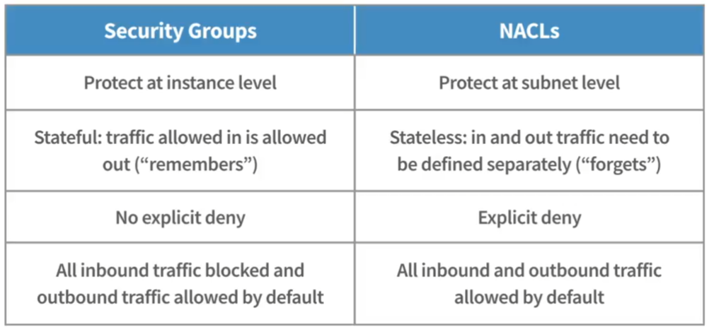
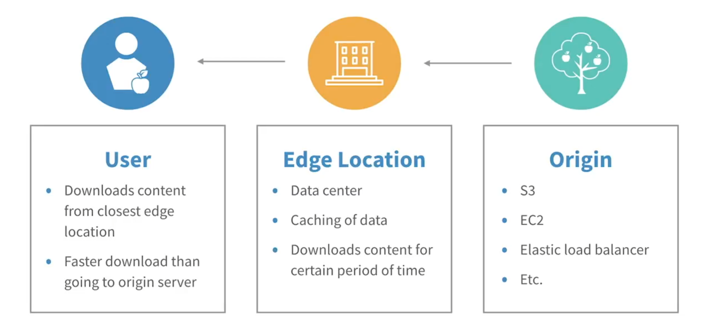

# AWS CLF-C02 Cert Prep Notes

## Cloud Computing Concepts

Cloud Computing = "On-demand delivery of compute, database storage, application, and other IT resources

Advantages of Cloud Computing:
* Trade capital expense for variable expense
* Benefit from massive economies of sale
* Stop guessing capacity
* Increase speed and agility
* Stop spending money running and maintaining data centers
* Go global in minutes

### AWS Well-Architected Framework (aka "How do I setup a good Cloud Architecture")
* Avoid unnecessary costs
  * Use only what you need. 
  * Reserve ressources. 
  * Cost-Monitoring
* Reliability
  * Disaster recovery
  * Redundancy
* Effiziency
  * Go global in minutes
* Security
  * Best practices should be automated
  * Data should always be protected
  * Traceability
  * Manage access
* Operational Excellence
  * Document everything
  * Refine operational procedures
  * Anticipate failure
  * Update processes
  * Learn from failures
        

### AWS Cloud Adoption Frameword (CAF)
=Best practices to migrate On-Premises IT to the Cloud

Value Chains
* Technological transformation: Use cloud to migrate and modernize IT
* Process transformation: Digitize, automate and optimize business operations
* Organizational transformation: Reimagine how your business and technology teams work together
* Product transformation: Reimagine the business model by creating new value propositions

Perspectives and Foundational Capabilities
* Business - Cloud investments accelerate digital transformation and business outcomes
* People - Culture of growth, learning and change
* Governance - Maximize organizational benefits while minimizing cloud-transformation-related risks
* Platform - Scalable hybrid cloud praltforms, implement cloud-native solutions, modernize existing infrastructure
* Security - CIA of cloud data and workloads
* Operations - Cloud services deliver business need
    
Cloud Transformation Journey (CTJ) - Is different on every company
* Envision phase - Envision goals and opportunities
* Align Phase - Identify capability gaps across the six CAF perspectives and dependencies
* Launch Phase - Pilot initiatives and incremental business value demonstration
* Scale Phase - Expand pilots and scaling up

## Security and Compliance

### Shared Responsibility Model

* Security OF the Cloud -> AWS
* Security IN the Cloud -> Customer

### Security in the Cloud Pillar of Well-Architected-Framework
* IAM
* Detective controls
* Infrastructure protection
* Data protection
* Incident response
    
Governance = The process of creating and enforcing decisions within an organization

### Providing Access in AWS
* Principle of Least Privilege
* IAM
  * WHO (users, workloads, roles)
  * CAN ACCESS (permissions with IAM policies)
  * WHAT (resources)
* Identities in AWS
  * Human identities / Workforce identities (Humans in own organization)
  * Workload identities
  * Federated identities: SSO, AWS IAM Identity Center (old: AWS Single Sign-On) with SAML 2.0
* Controlling Access to AWS
  * Roles
  * Policies
* Traffic Control
  * Security Groups - Apply to both inbound and outbound traffic
  * Network Access control lists (NACLs)

### Security Services
| Name | Description |
| :---: | :---------- |
| AWS Systems Manager | Manage AWS resources. Visualize and operate on multiple AWS services from one place. Create logical groups of resources. |
| AWS WAF | Classic WAF. Can be deployed in CloudFront (CDN) or API Gateway. |
| AWS Shield | DDoS Protection and automatic mitigations. Tier: Standard (Free). Tier: Advanced (24/7 access to AWS DDoS response team, Integrates into AWS WAF). Financial protection against DDoS-related spikes. Can be integrated into CloudFront and Route 53. |
| Amazon Inspector | Security assessment service for applications. Automatically assesses for exposure, vulnerabilities and deviations from best practices. Preset or custom policies. Reports. |
| AWS Trusted Advisor | Scans infrastructure and advises on how you follow AWS best practices based on five categories: cost optimization, performance, security, fault tolerance, service limits. Provides recommendations. Seven core checks for free: S3 bucket permissions, security groups, IAM use, MFA on root account, Elastic Block Store public snapshots, Relational Database Service (RDS) public snapshots, service limits. More Checks available together with notifications, automated actions (AWS CloudWatch) and AWS Support API access. |
| Amazon GuardDuty | 24/7 threat detection by machine learning, anomaly detection and threat intelligence. |
| AWS Artifact | Download AWS security and compliance documents and independent software vendor (ISV) compliance reports. |
| AWS Secrets Manager | Saves all secrets like passwords, credentials, tokes, access key and integrates with key AWS Services. |
Amazon CloudWatch | Monitors application performance. Set Alarms (based on predefined thresholds) and thus trigger automated actions. |
| AWS CloudTrail | Generates audit trails. |
| AWS Audit Manager | Automates evidence collection to generate audit-ready reports to prove system compliance for audits. |
| AWS Config | Detailed views of AWS resource configurations. Tracks how configurations and relationships between resources change over time. Can monitor changes and automatically alert. |
| Parameter Store | Stores configuration data for applications like plain-text strings or passwords. Ability to use the same key but contain different values for systems. |

## Cloud Technology and Services

### Interacting with the AWS Cloud

1. AWS Management Console
2. AWS Command Line Interface (CLI) - Requires the use of an access/secret key, that can be obtained from the IAM portal
3. AWS SDK's

Using Infrastructure as Code with services like AWS Elastic Beanstalk, Lambda and cloudFormation

### Connecting with the AWS Cloud
These options are available to connect On-Prem-Servers with the AWS Cloud:
1. AWS VPN
2. AWS Direct Connect - Bypasses Internet
3. Public Internet

### Cloud deployment models
* Cloud/Cloud-Native Deployment - All services hosted in the Cloud
* Hybrid Deployment - Infrastructure and data both in cloud an on-premises. Or backup.
* On-Premises

### AWS global infrastructure
* Availability Zones (AZs) - Separate Datacenters. Notated by a lowercase letter at the end of the region name like __eu-west-1a__
* Regions - A set of different datacenters (AZ's)
* Local Zones - When there is no Region close to the customers they have local Zones.
* AWS Wavelength Zones - Ultra-low-latency experience by embedding AWS compute and storage services withing 5G networks.
* AWS Edge Locations - Caching-Locations for the CloudFront-Service
* AWS Endpoints - Single instances of AWS services. Identified by __<Service + AWS-Region>+ amazonaws.com>__ for example __ec2.eu-west-2.amazonaws.com__.

[Quelle: Explanation of AWS global infrastructure](https://clarusway.com/aws-global-infrastructure/)

High availability is reached by hosting resources in multiple AZ's. The AZ's in a region are connected with a high performance internal network connection.
Different Regions have different AWS Cloud offerings.

### Compute Services
Amazon EC2 (Elastic Compute Cloud) are customziable virtual computers, called "instances". The different instance types are:
| Purpose | Description |
| :--- | :---------- |
| General purpose | General-purpose workloads |
| Compute optimized | Compute-intensive applications |
| Memory optimized | Processing large datasets in memory |
| Storage optimized | High access to large datasets |
| Accelerated optimized | Requiring high processing capabilities |

Other compute services:
| Purpose | Description |
| :--- | :---------- |
| Amazon Elastic Container Service (ECS) | Fully managed container orchestration. You have to configure the EC2-Instances by yourself (compare to AWS Fargate) |
| Amazon Elastic Kubernetes Service (EKS) | Fully managed Kubernetes management service |
| AWS Elastic Beanstalk | Web Application PaaS which automatically launches an environment and creates and configures the AWS resources needed to run your code. |
| Elastic Load Balancing | Automatic distributing traffic between multiple servers. |
| AWS Lambda | Run code snippets, without provisioning servers. Event-driven. |
| AWS Fargate | Serverless compute engine for containers. Compatible with ECS and EKS. |
| Amazon Lightsail | Preconfigured and ready-to-user operating systems, web apps and development stacks |

### Storage Services

Three types of data which are stored in AWS:
| Purpose | Description | Examples
| :--- | :---------- | :---------- |
| Object | Unstructured data like photos and videos. Best suited for static data. Consist of the data itself, it's metadata and an identifier. | Amazon Simple Storage Service (S3) |
| File | Pieces of informations insida a folder in an hierarchy. | Amazon Elastic File Service (EFS) |
| Block | Units of blocks of data. Uses identifiers. | Amazon Elastic Block Store (EBS) |

__Amazon S3 Storage__ Classes:

| Class | Description |
| :--- | :---------- |
| S3 Intelligent Tiering | Automatically moving objects between cost-optimized access tiers. |
| S3 Standard | Frequently accessed for general-purpose. |
| S3 Standard-IA | Low-Cost for data that is accessed monthly. IA stands for Infrequent Access. |
| S3 Glacier Instant Retrieval | Low-Cost for rarely accessed, long-term archive data. |
| S3 Glacier Flexible Retrieval | Low-Cost Storage with low retrievall fees for backed-up data with minutes or hours as retrieval time. |
| S3 Glacier Deep Archive | Lowest-cost option for long-term archives with 12- or 48-hour retrieval time. |
| S3 One Zone-IA | Low-cost storage for infrequently accessed objects with rapid retrieval that don't require multi-AZ redundancy. |
| S3 on Outposts | Object storage for on-premises AWS Outposts environments. |

See also [Amazon S3 Storage Classes](https://aws.amazon.com/s3/storage-classes-infographic)

__Amazon Elastic Block Store (EBS)__ 

Are raw, unformatted block devices attachable to an EC2 instance even without rebooting. They are like external harddrives. You can add multiple EBS volumes to one EC2 instance and use them as file systems or hard drives. They are automatically replicated within its availability zone. Features are:
 * Different types
 * Do not disappear when EC2 instances are rebooted
 * Can be encrypted
 * Exist independently of EC2 instances, so that they can be moved to other instances

__AWS Snow Family__

AWS hybrid cloud service: Extends AWS infrastructure and services into the edge. These are hardware services (physically ship these devices to you).
| Name | Description |
| :--- | :---------- |
| AWS Snowcone | 8 TB of HDD or 14 TB of SSD storage with 4 GB memory. Provides Edge Computing, where is no internet connectivity. Collect and process data. Transfer data back to AWS over the internet by utilizing AWS DataSync or shipping back the device. |
| AWS Snowball | 80-210 TB of storage capacity with 80-416 GB of memory. Choose between compute optimized or storage optimized. HIPAA Compliant. |
| AWS Snowmobile | Shipping Container. Exabyte-scale data migration device. Up to 100 Petabytes of data. HIPAA Compliant. |

__AWS Storage Gateway__

Connect S4 or EBS with local data. Installed on on-premises server. Divided into file (S3), volume (EBS) and tape gateway. The volume gateway can be configured as stored (complete copy) and cached (most recently accessed) volume.

__AWS Backup__

Policy-Based backup service.

### Database Services

__Relational Databases__

Data in tables with predefined relationships between them. Interface is SQL. Service is Amazon RDS, which supports six different database engines:
* Amazon Aurora
* Oracle
* Microsoft SQL Server
* MySQL
* PostgreSQL
* MariaDB

You can use AWS Database Migration Services (AWS DMS) to migrate existent databases to RDS. If you have a non-compatible DB-Schema you can use the AWS Schema Conversion Tool (AWS SCT).

__NoSQL Databases__

Built for lots of data. Variety of data models, like key-value, document, graph. Such a service is Amazon DynamoDB key-value database.

__In-Memory Databases__

Rely on internal memory of RAM. Ideal for fast response times. Examples are Amazon MemoryDB for Redis, Amazon DAX, Amazon ElastiCache

__Amazon Redshift__

Petabyte-scale data warehouse service. Stores extremely large amounts of data, collected from a wide range of sources to analyze.

### Network Services

__Amazon Virtual Private Cloud (VPC)__

Logically isolated section in the cloud to provision resources. 

__Amazon CloudFront__

Amazons content delivery network service. System of delivered servers. Using edge locations for faster retreival of data. The edge locations downloads contents for a period of time and caches data which it loads from the origin like S3, EC2, Elastic Load Balancer and so on.

__AWS Global Accelerator__

Throws the web traffic on the superspeed AWS global network instead of public networks. Availability and speed increases up to 60%.

__Amazon Route 53__

Highly scalable cloud Domain Name System (DNS). Routes end users to your internet applications. Features are:
* Domain registration
* Domain Name System
* Health check of web apps
* Auto-naming for service discovery

### AI Services

__Amazon SageMaker__

Fully managed machine learning (ML) service. Helps to build, train and deploy ML models for whatever use case like product recommendation features, robotics and voice-assisted devices.

__Amazon Lex__

AI service to build bots with sophisticated voice and text conversational AI.

__Amazon Kendra__

Utilizes machine learning to help find answers faster with intelligent search. Using natural language processing (NLP) to find information.

__Data Lake__

Repository to store structured and unstructured data. Run analytics to provide data processing, real-time analytics, machine learning and more.

__Amazon Athena__

Analyzes data directly in Amazon S3 using standard SQL.

__AWS Glue__

Integrates data from over 70 data sources and prepares the data for analytics by "cleaning it up".

__Amazon Kinesis__

Collect, process and analyze data like images, videos and else in real time at any scale.

__Amazon QuickSight__

Business intelligence service wich ML integrations to quickly build visualizations and ad hoc analysis on your data.

### Management Tools

__AWS CloudFormation__

Deploys IaC. Create templates for resource deployment. Provision and deploy fully configured infrastructure. Free to use. Written in JSON and YAML and used in Management Console, CLI oder SDK.

__AWS CloudTrail__

Main purpose: Logging. Track User and API usage. Logging and monitoring account activities and event history. Discover/troubleshoot security and operational issues. Automatically respond to security threats. Deliver reports to S3 buckets or CloudWatch logs and events. Free review of account activities for the past 90 days. 

__Amazon CloudWatch__

Main purpose: Performance monitoring and reacting on it. Monitoring and management system for AWS infastructure. Gain system-wide visibility into resource utilization, application performance and operational health.

### Other services

See also [Amazon Products](https://aws.amazon.com/products).

__Business Application Services__

 * Amazon Connect - AI powered Help Service 
 * Amazon Simple Email Service (SES) - Cloud E-Mail Service Provider to use in your app.

__Customer Engagement Services__

* AWS Activate for startups - Support for start-ups to use AWS as their backend.
* AWS IQ -  Get in connection with customers who need you knowledge.
* AWS Managed Services (AMS) - Enterprise service that provides ongoing management of your AWS infrastructure.
* AWS Support

__Developer Tool Services/Capabilities__

* AWS AppConfig - Adjust application behavior in production environments without full code deployments. Provides an API to perform tasks against resources throughout AWS.
* AWS Cloud9 - Cloud-IDE
* AWS CloudShell - Cloud-CLI
* AWS CodeArtifact - Artifact-Management
* AWS CodeBuild - Buildserver
* AWS CodeCommit - Private Git-Repository
* AWS CodeDeploy - Automation of code-deployments
* AWS CodePipeline - CI/CD-Pipelines.
* AWS CodeStar (deprecated) - Develop and deploy AWS-Apps
* AWS OpsWorks - Provides Managed Instances of Puppet Enterprise and Chef Automate.
* AWS X-Ray - Analyze and debug apps

__End-User Computing Services (VDI)__

* Amazon AppStream 2.0 - Streaming of Desktop-Apps in the browser
* Amazon WorkSpaces - VDI Thin Client
* Amazon WorkSpaces Web - VDI Web

__Front-End Web and Mobile Services__

* AWS Amplify - Fullstack App development
* AWS AppSync - GraphQL-APIs

__IoT Services__

* AWS IoT Core - Connect IoT to the cloud
* AWS IoT Greengrass - Messaging and synchronization of IoT Devices

## Billing, Pricing, and Support
TBD