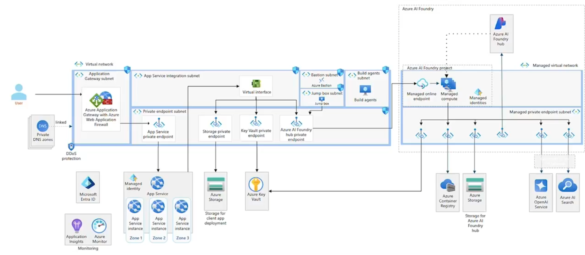
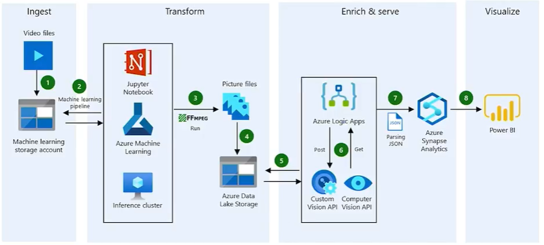

# Azure AI Engineer Associate (AI-102) Prep Notes

## Plan Azure AI Solutions

### Vision Services

| Name | Description |
| :----- | :----- |
| Azure AI Vision | Pre-built image and video analysis |
| Custom Vision | Train custom image classifiers |
| Face API | Face detection and recognition |
| Document Intelligence | Extract text from documents |

### Language and Speech Services

| Name | Description |
| :----- | :----- |
| Azure AI Language | Text analysis, sentiment, NER |
| Azure AI Translator | 100+ languages translation |
| Azure OpenAI Service | Advanced language models |
| Speech-to-Text/Text-to-Speech | Extract text from documents |
| Speaker Recognition | |
| Speech Translation | | 

### Decision and Search Services

| Name | Description |
| :----- | :----- |
| Content Safety | Content moderation |
| Azure AI Search | Cognitive search solution |
| Knowlege Mining | Extract inisights from content |
| Azure AI Model Inference | Flagship model inference |
| Azure AI Agent Service | Generative AI with real-world data |

### AI Development Environment

| Name | Description |
| :----- | :----- |
| Azure AI Foundry Portal | Central hub for AI service development, Model deployment, monitoring, resource management and scaling. |
| Azure AI CLI and SDK's | CLI's, SDKs, REST APIs |

### Key Principles

Six principles AI framework
* Fairness
* Reliability and Safety
* Privacy and Security
* Inclusiveness
* Transparency
* Accountability

## Design AI Architectures

### Types of Business requirements

* Functional - What the AI System should do like image classification
* Performance - Latency, Throughput, Scalability
* Data - Data needs of the AI System like volume and variety
* Security - Access control, data protection and compliance
* Cost - Budgets

### Architectural patterns

* Batch Processing - Process data in large chunks
* Real-time Inference - Process data as it arrives
* Hybrid Architectures - Combine both
* Edge AI



### Configure services AI for Performance

* Compute Targets (CPU or GPU) - Select the appropriate compute resource
* Model Optimization - Reduce model size and complexity
* Hyperparameter Tuning
* Deployment

### Monitoring

* Azure Monitor - Track performance and metrics
* Bottleneck Identification - Identify performance bottlenecks
* Alerts - Setting up alerts to detect performance degradation

### Caching

* API Response caching
* Model Prediction caching
* Azure Cache for Redis - Implement caching

### Load Testing

* Performance under stress
* Load Testing Tools like Azure Load Testing and Application Insights

## Manage and Secure AI Solutions

### Implement Monitoring and Logging

Main tool is Azure Monitor with uses

* **Metrics** - Numerical values, that describe the performance of Azure resources overt time like CPU usage, memory consumption, network traffic and so on. It's stored in a time-series database and analyzed using Portal, CLI, SDK and API's.
* **Logs** - Detailed records of events that occur like application logs. It's stored in Log Analytics Workspaces and analyzed usinig KQL.

### Apply security best practices to AI workloads

* Access Control - Use Built-in or Custom Roles and Entra ID Priviledged Identity Management
* Secure Endpoints and Identities - Like Private Links and Managed Identities
* Encryption at Rest - Azure Storage Service Encryption or Customer-Managed Key
* Encryption in Transit - TLS certificats and using Azure Key Vault for Secrets Management
* AAA - Conditional Access, RBAC, Azure Monitor

Authentication in general follows the following flow: Private Link + Entra ID > Managed Identity > API Keys.

## Moderate Text Content

### Content safety categories

| Category | Description | Severity Levels | Numeric Values |
| :----- | :----- | :----- | :----- |
| Hate | Content promoting hate or violence against groups | Safe, Low, Medium, High | 0,2,4,6 |
| Sexual | Sexually explicit or suggestive content | Safe, Low, Medium, High | 0,2,4,6 |
| Violence | Depictions or descriptions of violence | Safe, Low, Medium, High | 0,2,4,6 |
| Self-Harm | Content related to self-injury or suicide | Safe, Low, Medium, High | 0,2,4,6 |

### Automated compliance workflows

Components:

* Input triggers
* Integration with Azure AI Content Safety
* Decision logic based on moderation scores
* Actions for approved, flagged and rejected content

[Python Script Example](./Resources/Scripts/AI102-ContentAPI.py)

## Moderate Image Content

### Implement Image moderation

Moderate unsafe content at scale with Content Safety and Vision API.

| Feature| Content Safety API | Vision API |
| :----- | :----- | :----- |
| Harm Categories | Yes (hate, sexual, violence, self-harm) | No |
| Adult/Racy Detection | Yes | Yes |
| Image + Text Support | Yes | No (image only) |
| Use Case | Deep content filtering | Lightweight adult flagging |

[Vision Studio Link](https://portal.vision.cognitive.azure.com/)

Results of the Vision API will have a text, polygons ("boundingPolygons") around the identified text and a confidence score. 

Categories in Image moderation might be:
* Optical character recognition (OCR) = Find text in images
* Spatial analysis = Find stuff in a 3D environment (aka Video)
* Face = Face recognition
* Photo ID matching = Match a photo ID to a person's face

## Analyze Images with Pre-Built Models

Azure AI Vision = pre-trained models, no ML expertise needed

* Ideal for object detection, scene understanding and image tagging
* Part of Azure Cognitive Services

[Python Script Example](./Resources/Scripts/AI102-VisionAPI.py)

## Create Custom Computer Vision Models

Use Custom Vision API Models when prebuilt models fail your domain. Choose the base domain that is closest to your use case (i.e. "Food", when you need to built a custom "tomato"-Model). 

The flow is:
1. Create project (classification or detection)
    * Classification = Image classification tags whole images
    * Detection = Detection finds the location of content within an image
2. Add tags and images (>=50/tag recommended)
3. Workflow
    1. Train - Via API or the [Custom Vision Training Site](https://www.customvision.ai/)
    2. Evaluate - Test with Test-Images
    3. Publish - Access via API or Download the model in different formats

Metrics to deal with are:

* **Precision**
    * Base question: How many of the cases predicted to be positive were actually positive? 
    * Focus: Avoiding false positives.
* **Recall**
    * Base question: How many of the actual positive cases did the model find? 
    * Focus: Finding all positive cases (avoiding false negatives).
* **F1**
    * Base task: The F1 score is the harmonic mean of precision and recall. It combines both metrics into a single value to provide a balanced overall picture of model performance. 
    * Focus: When both false positives and false negatives are to be avoided.

### Endpoints for Models

* CoreML (iOS) - Run Model on iPHones and iPads
* TensorFlow (Android) - On Android apps or edge devivces with TensorFlow Lite
* ONNX - Integrate into Windows ML, ML.NET or cross-plattform apps using open standards
* Dockerfile - Package for Azure IoT Edge, Functions or custom containers in Azure MLVision
* AI Dev Kit (VAIDK) - Deploy models to physical camera devices.



[Python Script Example](./Resources/Scripts/AI102-CustomVisionAPI.py)

## Analyze Video Content

### Azure AI Video Indexer

Is a prebuilt pipepline combining Vision, Speech and Language AI accessible via Portal, REST API and SDK. It extracts:

* Spoken words (speech-to-text)
* Faces and emotions
* Brands, topics and scenes
* OCR text from frames
* Translations and keywords

## Process Text with Azure AI Language

Use Azure AI Language to extract structured insight from raw text. Supports over 90 languaged and is accessible via [Azure AI Language Studio](https://language.cognitive.azure.com/), REST API and SDK.

It extracts:
* Positive, neutral and negative tones
* Key themes with Key Phrase Extraction
* Confidence scores
* Auto-language detection

Use in feedback analysis, support prioritization and brand monitoring:
* Named Entity Recognition (NER) identifies/labels/classifies pleople, places, orgs
* PII detection on the other hand redacts sensitive data like Social Security Numbers, emails, phone numbers 

[Python Script Example](./Resources/Scripts/AI102-LanguageAPI.py)
[Python Script Example with asyncronous Requests](./Resources/Scripts/AI102-LanguageAPIpro.py)
[Python Script Example with long running Objects](./Resources/Scripts/AI102-LanguageAPI-LRO.py)

## Build Conversational AI with Bots

The Azure Bot Service is a managed Azure service to register, deploy and manage bots. It supports the Bot Framework SDK or Copilot Studio.

Definitions:
* **Bots** are nothing more or less than conversational user interfaces.
* **Channels** (the "Client side") include Microsoft Teams, Web Chat, Slack, WhatsApp and custom web clients.
* **AI Agents** are autonomous workflows powered by tools like AutoGen, Semantic Kernel, Lang Chain etc. They let us build AI that reasons, plans and acts.
* **RAG** Retrieval augmented generation. Let the model "read up" before answering.

Can optionally use integrations like:
* Azure AI Language (intent/QA)
    * Answer user questions
    * Detect intents (CLUs - Conversational Language Understanding) 
* Azure Cognitive Searchs (RAG Grounding)
* Azure OpenAI (for generative replies)

Microsofts perferred modern bot pattern is:
* AI Language or OpenAI for Natural Language Processing (NLP)
* Cognitive Search for Grounding
* Azure Communication Services (ACS) + Direct Line for Multichannel reach

[Python Script Example](./Resources/Scripts/AI102_QuestionAnswering.py)

## Implement Speech-to-Text Solutions

Can be accessed via SDK for live transcription in apps, by REST PI for batch jobs on stored files or [Microsoft Foundry > Playgrounds > Speech-Playground](https://ai.azure.com/). The incoming formats are WAV, MP3, OGG or mic/network audio.

The flow is:
1. Input: An audio stream or file is sent to Azure endpoint
2. Decode: An acoustic model decodes sound into phonemes
3. Assembling: A language Model assembles phonemes into text
4. Appling Enhancements: Profanity mask, custom phrases, speaker ID
5. Output: JSON with text and confidence scores

Transkription models can be optimized for accuracy with:
* Custom Speech - Train on labeled audio + text
* Phrase hints - Accuracy for key terms
* Features - Language ID, multi-channel, diarization
* Metrics - track WER and view logs in Azure Monitor
* Compliance - PII masking
* Containers - support offline or air-gapped use

Deployment patterns:
| Deployment | Usage |
| :----- | :----- |
| Client SDK | Capture MIC input on desktop, mobile, IoT |
| REST API | Save Audio to blob / Batch |
| Hybrid | Local preprocessing > Cloud analytics |
| Edge | Run containers in secure or offline sites |
| Security | Key Vault, Private Link, RBAC |
| Monitoring | Azure Monitor alerts and logs |

[Python Script Example](./Resources/Scripts/AI102_SpeechToText.py)

## Deploy Text-to-Speech Solutions

Azure AI Speech supports more than 400 Voices in 140+ languages. Can be used for reading dynamic content in the user's preferred language. Is accessible via [Microsoft Foundry > Playgrounds > Speech-Playground](https://ai.azure.com/), REST API or SDK. Include styles like 'cheerful', 'assistant' and 'newscast'.

In Use-Cases the text has to be translated first and then synthesized. Otherwise the pronounciation may be wrong. The flow is:

1. User Inputs text
2. Azure Translator translates into target language
3. Azure Speech SDK applies SSML (Speech Synthesis Markup Language) Customization
4. TTS Engine generates Speech Audio
5. Output the Audio

### SSML
SSML is markup for pitch, rate, pauses, volume and emphasis. By this we can swap voices and emotions [see Speech Studio Voice Gallery](https://speech.microsoft.com/portal/voicegallery). It works in REST and SDK.

Important tags are:
* \<voice> - Switch speakers
* \<break time="500ms"> - pause naturally
* \<prosody rate="slow" pitch="+10%"> - control delivery
* \<phoneme ph="t€k 'tr€ina"> - fix pronunciation
* \<lang xml:lang="fr-FR"> - mix languages

SSML Example:
```xml
<speak version='1.0' xml:lang='en-US'>
    <voice name='en-US-JennyNeural'>
        <mstts:express-as style='cheerful'>
            <prosody rate='slow' pitch='+10%'>Welcome to Paris!</prosody>
            <break time='500ms'/>
            <emphasis level='moderate'>Your stay in our Hotel is confirmed.</emphasis>
        </mstts:express-as>
    </voice>
</speak>
```
### TTS Best-Practices
* Use Azure Key Vault for API Keys
* Pre-generate frequent phrases
* Don't feed raw translations to TTS
* Test audio for pacing and tone

[Python Script Example](./Resources/Scripts/AI102_TextToSpeech.py)

## Translate and Localize Content

The Azure Translation Service is capable of Real-time text translation, broad language support, custom translation and document translation with access via [Language Studio](https://language.cognitive.azure.com/translation), SDK, REST API and container support.

It's possible to use Azure Functions, Azure Logic Apps or Power Automate to automate translation workflows.

[Python Script Example](./Resources/Scripts/AI102_Translator.py)

## Deploy Knowledge Mining Solutions
 
Knowledge mining = Extracting structured info from unstrctured content (PDFs, images, ...). It combines AI Search, Document Intelligence and AI Language.

### Azure AI Search

The main components are Indexes, Indexers, Skills and Data Sources. To built an usable Azure AI Search Service follow this procedure:
1. Connect to Data - Select data sources like Databases, Storage Services or Data Lakes
2. Add cognitive skills - For example document intelligence
3. Customize target index - Create an index with key extracted fields from the source data. It's the actual search database for your data. It's like a book index and tells you where to find data.
4. Create an indexer - Extract load agent. It pulls data from the source, extracts data and pulls it into the index.

### Vector based search

Azure AI Search (formerly Azure Cognitive Search) is working with vectors:
* Contents are transformed into vectors ('embeddings').
* All vectors are safed in a vector-DB.
* The search-term is also transfered into a vector.
* The database is finding the closest vectors - these are the most relevant contents.

### Creating and managing indexes

* An index defines the structure of searchable content, including fields and data types.
* Use the Azure portal or REST API to create and manage indexes.

[Python Script Example](./Resources/Scripts/AI102_SearchAPI.py)

## Extract Data from Documents

Azure AI Document Intelligence (formerly Form Recognizer) automates the extraction of information from documents using machine learning. It supports prebuilt models (i.e. invoices, receipts, ID cards, credit cards, contracts, business cards) for common document types and custom models for specific layouts. Specialization on forms. It is accessible via SDK, REST API and the [Document Intelligence Studio](https://contentunderstanding.ai.azure.com/documentintelligence/studio). It supports PDFs, images and scanned forms.

Supported File-Formats:
* PDF
* Images: JPEG/JPG, PNG, BMP, TIFF, HEIF
* Office: Word (DOCX), Excel (XLSX), PowerPoint (PPTX), HTML

[Python Script Example](./Resources/Scripts/AI102_DocumentIntelligenceAPI.py)

## Leverage Azure OpenAI Services

GPT models enable generative tasks like summarizing, rewriting and explaining content. Azure OpenAI exposes models via chat/completions API. Prompts are structured as role-based messages: system, user, assistant.

* **OpenAI** is an AI research lab who created the Generative Pretrained Transformer (GPT) and other of its variants like DALL.E (Images), Whisper, Sora, Operator, etc.
* **ChatGPT** is OpenAI's consumer SaaS app powered by GPT models. It's hosted at chat.openai.com and includes tools like code interpreter and web browsing.
* **Microsoft Copilot** embeds GPT models into M365, GitHub and more.
* **Azure OpenAI Service** offers private access to OpenAI's models via REST APIs and SDKs in the Azure ecosystem
* **Azure AI Foundry** offers GPT-4, GPT-4 Turbo (Text & Code), Embeddings and DALL.E 3 models with security, governance and quota controls.

Models are deployed via [Azure Foundy Portal](https://oai.azure.com/resource/deployments) (either OpenAI Service or Foundry Service) or CLI.

**Assistant (Azure OpenAI)**
* = "Workflow"
* Defined behavior + tools
* Built-in Azure AI Studio
* Chat based & goal-driven
* Powered by deployed GPT

**Agent (Azure AI Agent Service)**
* = "Chat"
* Executes tasks autonomously
* Orchestrated by Agent Service
* May act without user prompting (autonomy)
* Support tools, memory, triggers
* The agent in "agentic AI"

[Python Script Example](./Resources/Scripts/AI102_OpenAI.py)

## Optimize Generative AI Models

### Prompt engineering

* No training, just smart input crafting
* Giving the model system messages, few-shot examples and delimiters
* Use when cost/time must stay low

### Fine tuning

* Upload labeled data to teach a model custom patterns
* Great for structured outputs
* Costs a lot to train the model
* Integrates data directly into the model instead of "RAG" or read it up in front of each request

### Retrieval-augmented Generation (RAG)

* Create a vector store + data retrieval pipeline
* Embed custom content into the store
* Model retrieves chunks as context for queries
* No training required; easier to update content

## Implement Responsible AI Practices

The six responsible AI practices framework:

| Principle | Description |
|:----|:----|
| Fairness | Ensure models treat all people and groups equitably by detecting, measuring, and mitigating bias and data in predictions. This often involve personally identifiable information and other secrets. |
| Reliability & Safety | Validate performance under real world conditions, run continuous tests, and build safeguards to prevent harmful failures. |
| Privacy & Security | Protect personal data by design, enforce strong encryption, manage access controls, and comply with regulatory requirements. |
| Inclusiveness | Design for diverse user needs, support accessibility features, and avoid excluding any community or ability level. |
| Transparency | Document model designs, share decision making logic, and communicate limitations so stakeholders can understand how our AI works. |
| Accountability | We assign clear ownership, establish governance processes, and maintain audit trails to monitor, review, and remediate through the AI lifecycle. |

### Build transparent AI systems

* Identify and mitigate model bias (training data, prompts, access patterns)
* Document model behavior with transparency notes
* Add explanation layers to model outputs
* Log and trance prompts and completions using Azure AI telemetry

### Tool to detect and explain model bias

* Azure Ai Content Safety: Detect harmful outputs
* Prompt Flow evaluation nodes: Assess prompt relevance and fairness
* Responsible AI dashboards (SDK v2): Visualize disparity across groups
* Fairlearn library: Generate fairness metrics and parity charts.

### Bake in privacy, safety and compliance

* PII detection and content filters
* Secure endpoints with Entra ID, RBAC and managed identities
* Store secrets in Azure Key Vault
* Enable audit trails with Azure Monitor and Log Analytics
* Follow region-specific compliance rules (GDPR, HIPAA, ...)
* Prompt shielding to prevent risky completions in Azure OpenAI

### Groundedness detection

Groundedness describes, how much of the LLM's answer is "grounded" or based on what it learned before. Depending on the Model and its Generation it saves communications like a log file. But with the time the limit exceeds older data is removed. Groundedness detection figures out if the LLM's responses are still based on the "Source of Truth". Or to say it simple: It tries to prevent or at least detect hallucination.

## Monitor and Optimize Azure AI Solutions

### Instrument services with diagnostics

#### Diagnostic services

* Azure Monitor is for platform telemetry
* Application Insights for performance and usage
* By enabling diagnostic settings on the resources we can set up alert rules for error spikes, latency, etc.

#### Logging

* Stream diagnostic logs to Log Analytics
* Query with Kusto (KQL) for insights
* Use log-based alerts for precision
* Integrate logs with Azure Dashboard or Sentinel

#### Using KQL

* Use Kusto Query Language (KQL) in Log Analytics
* Filter logs from Azure AI resources by time, result or caller
* Project relevant fields: time, response, user agent, error code
* Built charts in Azure Monitor workbooks or set alert rules

KQL-Example:
```SQL
Azure Diagnostics
| where ResourceProvider == "MICROSOFT.COGNITIVESERVICES"
| where OperationName == "PromtCompletion"
| extent prompt = tostring(parse_json(RequestPayload).prompt)
| extent completion = tostring(parse_json(ResponsePayload).completion)
| project TimeGenerated, prompt, completion, userSentiment
| order by TimeGenerated desc
| take 5
```

### Govern cost with workbooks and alerts

* Use built-in or custom Azure Monitor workbooks
* Visualize usage by model, resource group, SKU
* Correlate token usage with billing

```console
az consumption budget create \
--resource-group ai-102
--amount 100 \
--name aiUsageCap \
--time-grain monthly \
--notifications \
    emailHook={
        "enabled": true,
        "operator": "GreaterThan",
        "threshold": 80,
        "contactEmails" : ["ai102Operations@example.com]
    }
```

### Auto-scale & update container deployments

* Use Azure Container Apps or AKA
* Define CPU/memory/queue-based rules
* Support rolling upgrades or blue/green
* Monitor health probes and logs

### Modernize Model deployments

* Version with labels or tags
* Roll forward with canary (small amount of users on new version and then enlarge) or blue/green (live vs update environment and switch traffic dynamically)
* Route traffic incrementally
* Rollback on failure detection

### Trace, collect feedback and reflect models

* Enable tracing in Azure AI Foundry.
* Use feedback signals (thumbs up/donw, starred completions)
* Log feedback in Cosmos DB or App Insights.
* Evaluate using Prompt Flow or manual review.

## Useful links

### Preparation Roadmaps
[AI-102 Exam Preparation](https://github.com/Arturo-Quiroga-MSFT/AI-102-Exam-Prep)

### Practice tests

[Free Full-Length Practice Exam](https://certificationpractice.com/practice-exams/microsoft-azure-ai-engineer-associate)

[AI-102 Free Practice Tests](https://www.testpreplab.com/AI-102-free-practice-test/)

[Examsland](https://examsland.com/free-practice-test/ai-102)

[OpenExamPrep](https://open-exam-prep.com/practice/azure-ai-102)

[Free AI-102 Mock Exam](https://www.freemockexams.com/AI-102-practice-test.html)

## Exam Tips

* Focus on matching between specific Azure AI services to business requirements (compare (Azure AI Architecture Framework)[https://learn.microsoft.com/en-us/azure/architecture/browse/?terms=Azure%20ai])
* Expect scenario-based questions where choosing the correct service involves considering Scalability, Security, Compliance, Cost and Performance trade-offs.
* In Sandbox Environments read through all the tabs. Each question will usually have the answer in one of the bullet lists in the tabs. Watch out for Buzzwords.
* Whenever you can decide between API key and RBAC, use RBAC as it is the best practice approach.
* What can you do, when you not have enough performance? Adjust the scale of the service.