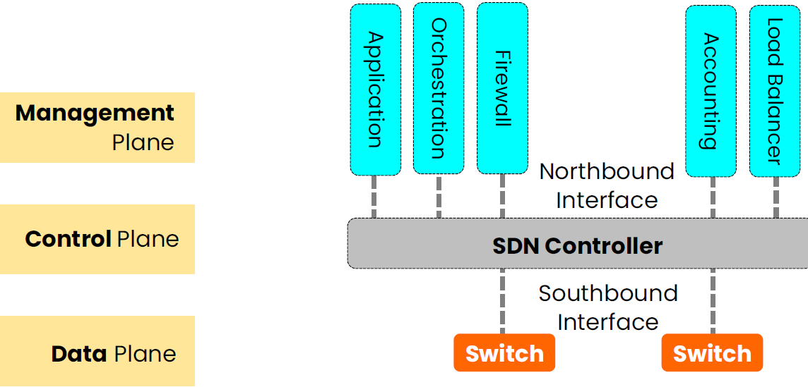

# Certified Cloud Security Specialist (CCSP) Prep Notes

SaaS most commonly uses client-side key management.

Windows Server Core offers a reduced attack surface.

TLS Protocols

* Handshake and record (secure transmission of data)

### Cloud data lifecycle

1. Create - Determining data classification.
2. Store - security controls can be implemented
3. Use
4. Share
5. Archive
6. Destroy

## Data Discovery

Means, that an organization is creating an initial inventory of data it owns or that the organization is involved in eDiscovery.

### Methods

### Terms

| Method | Description |
| :----- | :----- |
| Label-Based | By labels created by data owners in the Create Phase. |
| Metadata-Based | Often automatically created. Scan specific fields for particular terms. (Most effective method) |
| Content-Based | Term searches or pattern-matching. |
| Data Analytics | Datamining > Run queries over big data. Real-time Analysis and Agile Business Intelligence |.

* Quality is the biggest challenge
* Both cloud provider and cloud customer share responsibility for data collection and preservation and could be the recipient of the order.

### eDiscovery

THe process of identifiying and obtaining electronic evidence for either prosecuitrial or litigation purposes.

Standards are:
* ISO 27050
* CSA guidance

### Obfuscation Strategies

| Terms | Description |
| :----- | :----- |
| Masking | Hiding the data with useless characters. Showing only the last four digits of a Social Security number. |
| Obfuscation | Making the data less meaningful, detailed or readable. Can be done in **static** or **dynamic** configurations. With static a new data set is created as a copy from the original data, and only the obscured copy is used. In the dynamic method, data is obscured as it is called. |
| Anonymization | Removing the telltale nonspecific identifies. |
| Tokenization | Have two distinct databses: One with the live, actual sensitive data and one with nonrepresentational tokens, mapped to each piece of that data. | 

## Cloud Roles

| Term | Description |
| :----- | :----- |
| Cloud Service Provider | Company that provides cloud-based platform |
| Cloud Services Partner | Help organizations to obtain and deploy cloud services |
| Cloud Service User | Consumes services |
| Cloud Service Auditor | Can conduct an independent assessment |
| Cloud Broker | Manages the use, performance and delivery of cloud services. Negotiates relationships between cloud providers and cloud consumers |
| Cloud Administrator | Implementation, monitoring and maintenance of the cloud |
| Cloud Application Architect | Adapting, porting and deploying application |
| Cloud Architect | Designs and develops solutions |
| Cloud Operator | Responsible for daily operational tasks |
| Cloud Data Architect | Manages data storage and data flow |
| Cloud Service integrator | Responsible for connecting and integrating existing services and applications |
| Cloud Service Manager | Responsible for business
agreement, pricing for the cloud customer |
| Cloud Storage Administrator | Manages storage
volume/repository assignment and configuration |
| Cloud service business manager | Responsible for overseeing the billing, auditing and procurement of cloud services |
| Cloud service operations manager | Prepares systems
operations and support for the cloud, administers services |
| Managed Security Service Provider (MSSP) | Maintains the security environment like FW, IDPS, SIEM, SOC |
| Inter-Cloud Provider | Responsible for peering with other cloud services |

## Key Cloud Computing Characteristics

### Software-Defined Network (SDN)

Consists of three separate planes:

1. Management Plane
2. Control Plane
3. Data Plane

DaaS ?

Risk Frameworks

* GAPP - Generally Accepted Privacy Principles - Focuses on privacy risks
* ENISA - Major Framework in cloud computing
* ISO/IEC 31000:2018 - Major Framework for risk management
* NIST - Provides guideliens for risk in a cloud environment

EU Directive for personal data privacy = 95/46/EC

Continuous optimization - The process fo constant refinement of event discovery and collection, based on the changing application landscape and new and emerging threats.

### Cloud Concepts

| Term | Description |
| :----- | :----- |
| Elasticity | The Aaility to dynamically change resources to meet load. |
| Interoperability | The ease with which one can move or reuse components of an application or service. Five facets: Policy, Behavioral, Transport, Syntactic, Semantic data. |
| Portability | The ability to move between different providers. Prevents "vendor lock-in". Three facets are Syntactic, Semantic, Policy. |
| Resource pooling | The sharing of a large number or resources between different customers. |
| Reversibility | Process for customers to retrieve their data and application artifacts and the CSP to delete all cloud service customer data. | 

## To Learn

ISO 17789 Cloud Reference Architecture

Cloud Controls Matrix (CCM)

Types of AI

Shibboleth

DOM1 Page 109
