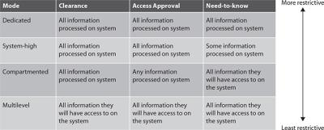
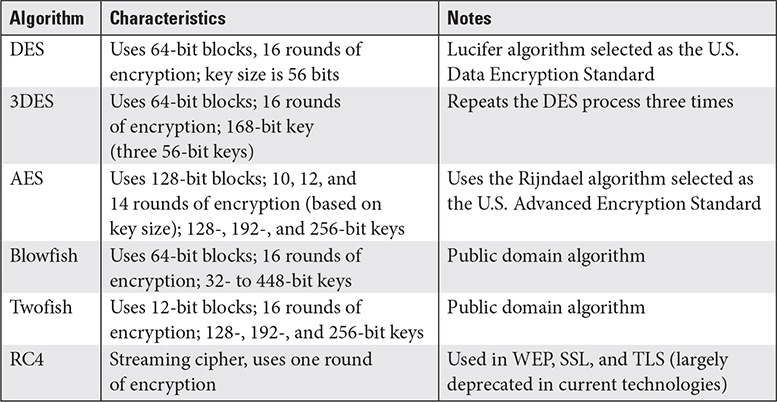
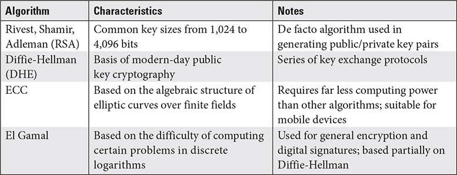
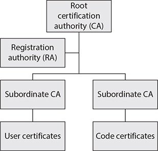
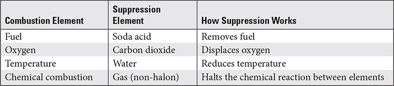
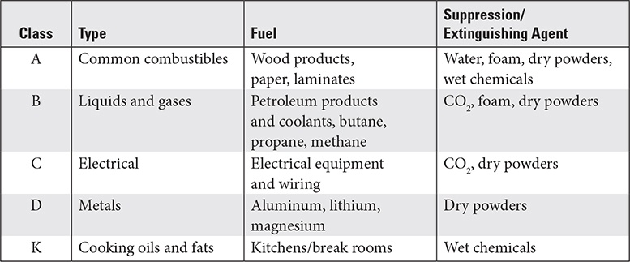

# CISSP Domain 3 - Security Architecture and Engineering

## Secure design principles
| Term | Description |
| :----- | :----- |
| Threat modeling | Describing detailed threats, events and their specific impacts on assets, determining specific threat actors and events and how they will exploit a range of vulnerabilities. |
| Least privilege | An entity should only have the minimum level of rights, privileges and permissions to perform their duties. |
| Defense in Depth | Multilayer approach to securing assets.  Can also be of administrative controls. |
| Secure defaults | Security controls should be secure configurated by default. |
| Fail securely (closed) | System fails in a secure manner (secure itself and prevent access to data). |
| Fail safe (open) | To protect human safety it has to open security mechanisms. |
| Separation of duties | One entity should not be able to perform multiple sensitive tasks that could result in the compromise of systems or information. (One admin and one auditor). Two-person control = two or more people are required to perform a complete task. |
| Keep it simple | Keep designs as simple as possible. |
| Zero trust | Each entity must always reestablish trust with one another. Mutual Authentication, periodic reauthentication and replay prevention. |
| Privacy by design | Considerations for individual privacy are built into the system |
| Trust but verify | Periodically reestablish and verify. Transactions are audited and monitored and trust is in accepted baselines. |
| Shared responsibility | Applies when more than one entity is responsible and accountable. Each entity has ist own prescribed tasks. |

## Security models

Often come from the military. Think in layers, where the generals have the secrets at the top (upper layer), officers and soldiers.

* Mandatory access control (MAC) - Security clearance, Management approval and need to know
* Single-state - Processor handle only one security level at a time
* Multi-State - Can handle several security levels concurrently

### Processing modes (from most to least restrictive)

| Term | Description |
| :----- | :----- |
| Dedicated security mode | single-state, users must have security clearance & management approval & valid need-to-know related to job position to access ALL information. |
| System-High Security Mode | Security Clearance & Management Approval & signed NDA for ALL information as well as valid need-to-know for SOME informations. |
| Compartmented security mode | Security clearance to ALL informations, Mgmt Approval for SOME, NDA for ALL, valid need-to-know for at least the information they will access. |
| Multi-level security mode | Security clearance at least equal to level of information, Mgmt Approval for ANY information they access and signed NDA for ALL information, need-to-know for at least information they will have access. |

### Confidentiality models

Only model for confidentiality: Bell-LaPadula, but a lot of models for integrity.

| Model | Description |
| :----- | :----- |
| Bell-LaPadula | State-Machine-Model. Simple security rule (No read-up / "Do not read information from upper layers"), *-property rule (No write-down / "Do not write information to lower layers"), Strong star property rule (Read and Write at the very same security level). |

### Integrity models

| Model | Description |
| :----- | :----- |
| Biba | State-Machine-Model, Simple integrity rule ("no read down"), *-integrity rule ("no write up"), invocation rule (no request or invoke a service from a higher integrity level). A manager must not allow himself to be influenced by lower layers. |
| Clark-Wilson | Well-formed transactions (Operations that transforms data to another state, while keeping the data consistent) with separation of duties (only valid subjects can transform/change data). |
| Non-Interference model | commands or activities performed at one security level should not be seen by or affect subjects at a different security level. |
| Brewer and Nash model | "Chinese Wall model" protect against conflicts. Subject can write only to an object if it cannot read another object. |

### Other models

| Model | Description |
| :----- | :----- |
| Graham–Denning model | The secure creation and deletion of both subjects and objects. |
| Harrison–Ruzzo–Ullman (HRU) | The assignment of object access rights to subjects as well as the integrity (or resilience) of those assigned rights. |
| Brewer and Nash model | permit access controls to change dynamically based on a user’s previous activity. |

## Selecting Security controls

### Considerations

* Consider cost, protection needs of the asset, the risk which is reduces, how it complies with governance
* Not implementing if it costs more than the asset is worth or if it is not sufficient enough
* Should not be selected after the system is already installed and working

### Requirements

* Performance (How well) and Functional (What) - Describe acceptable performance criteria
* Data Protection - Consider data criticality and sensitivity (BIA)
* Governance - Like HIPAA, PCI DSS, SOX
* Interface - How systems and applications interact with other systems
* Risk response - Risk assessment and analysis

## Security capabilities (Hardware/Firmware)

### Trusted Platform Module (TPM)

Hardware component installed on the main board, carries out several security functions (storing cryptographic keys and digital certificates, encryption and hashing).
* Scenarios
  * Binding a hard disk drive - Works only on a particular system by using encryption, prevents stealing
  * Sealing - Encrypting the data for a systems specific hardware and software configuration, prevent tampering
* Types of memory
  * Persistent memory
  * Versatile memory
* Types of keys stored
  * Endorsement key (EK) - Public/private key pair installed at manufacturing. Persistent
  * Storage root key (SRK) - master key used to secure keys stored in the TPM. Persistent
  * Platform configuration registers (PCRs) - Store cryptographic hashes to seal the system. Versatile
  * Attestation identity keys (AIKs) - Attest to the validity and Integrity of TPM chip itself. Versatile
  * Storage Keys - Encrypt storage media. Versatile

### Hardware Security Module (HSM)

Same as TPM but TPM is a chip and HSM is a peripheral device.

### Self-Encrypting drive (SED)

Drive with encryption mechanisms built into the drive electronics. Key is stored within the drive itself, can be managed by a password.

### Bus encryption

Ensures data is encrypted while in use except when being directly accessed by the CPU, uses a cryptoprocessor (specialized chip built into the system).

### Trusted Execution Environment (TEE)

Secure, separated environment in the processor.

* Apple refers to it as a secure enclave
* Creates a trusted perimeter around the application processing space
* Has ist own access to hardware resources
* Is referred to as memory protection

### Processor Security Extensions

CPU Instructions specifically created to provide trusted environment support.

### Atomic execution

A method of controlling how parts of applications run.

* Leverage operating system libraries that invoke hardware protections during code execution
* Is either fully executed or not performed at all.
* Protects against timing attacks (TOC - time-of-check, TOU - time-of-use) - asynchronous attacks

## Architectures, Designs and Solutions

### Client-Based Systems

Use applications, that are entirely executed on a single device. Still require patches and updates, may require connections to external storage devices.

__Vulnerabilities:__ Simple authentication, weak encryption, single-point-of-failure

### Server-Based Systems

Two-tiered architecture (client/server).

__Vulnerabilities:__ OS and app vulns, weak auth, weak encryption, nonsecure communications

### Distributed Systems

N-tier computing, share processing between hosts (storage, security, data transformation).

__Vulnerabilities:__ Nonsecure communications, integrity of data flow, weak auth, weak encryption, OS and app vulnerabilities.

### Database Systems

Relational DBs are based on tables wird rows (records) and columns (fields). The key uniquely identify a record. The primary key identifies a record based upon non-repeating data. A foreign key is used to establish a relationship with a different table. Indexes are keys that facilitate data searches within the DB.

Other types are:
* Flat-file DB - Text files or comma-separated fields
* NoSQL - Not only SQL are used for high volume of input and output
* Hierarchical DB - A main data element has several nested hierarchies
* In-Memory DB - A database which is kept and executed only in memory for fast access.

__Vulnerabilities:__ Poor design, inadequate interfaces, lack of proper permissions, DBMS vulnerabilities.

__Measures:__ Restrictive views, constrained interfaces, DB encryption, Vuln/Patch-Mgmt.

### Cryptographic Systems

__Vulnerabilities:__ Weak algorithms and keys, Issues who crypographic system is implemented

### Industrial Control Systems (ICS)
* Designed to control physical devices in mechanical processes.
* Proprietary devices, programming languages, protocols, stand-alone
* Distributed Control System (DCS) is a networking ICS.
* Supervisory control and data acquisition (SCADA) cover a large geographic area and consists of multiple devices, mixing traditional IT and ICS.
* Concepts and technologies
  * Programmable logic controllers (PLC) - control electromechanical processes
  * Human-machine interfaces (HMI) - Monitoring and Interacting with ICS.
  * Data historian - Server as a data repository for ICS devices and stores sensor data, alerts and so on.
* OT = IT + ICS devices into one system

__Vulnerabilities:__ No Authentication or encryption, weak security controls
  
### Internet of Things (IoT)

Consumer-driven versions of ICS devices which connect to the internet
__Vulnerabilities:__ Inadequate security, no advanced authentication, encryption or other security mechanisms.

### Embedded Systems

Integrated computers within a system, designed for specific uses and limited processing and storage.

__Vulnerabilities:__ No robust, built-in security mechanisms, not easily updatable or patched.

### Cloud-Based Systems
* Cloud Service Provider (CSP) are providing services in three models:
  * Software as a Service (SaaS) - Applications offered
  * Platform as a Service (PaaS) - Virtualized computers are provisioned
  * Infrastructure as a Service (IaaS) - Networking infrastructure und virtual hosts

* Other services
  * Security as a Service (SECaaS) 
  * Database as a Service (DBaaS)
  * Identitiy as a Service (IDaaS)

* Deployment models
  * Private cloud - Client organization owns infrastructure or subscribes to a dedicated portion of CSP
  * Public cloud - Public cloud infrastructure
  * Community cloud - Shared between organizations
  * Hybrid cloud - Combination of any or all other deployment modes

__Vulnerabilities:__

* Delineated responsibilities
* Administrative access to devices and infrastructure - limited access or abilities for configurations
* Auditing - Shared responsibilities for auditing actions
* Configuration and patching - must be detailed in the agreement
* Data ownership and retention - accesses by CSP's personnel but accountability remains with the client
* Legal liability
* Data segmentation

### Virtualized Systems

Exist in simulated enviroments.

* Two hypervisor types:
  * Type I - Bare-Metal hypervisor - runs directly on hardware
  * Type II - A software application running on top af an existing OS.

Containerization = Smaller simulated environments are called Containers (Kubernetes, Docker).

### Microservices

App functionality are divided up into much smaller components which are loosely coupled. Serverless - Services are deployed as microservices. A dedictated hosting service is not required.

### High-Performance Computing Systems (HPC)

Designed to solve large problems. Extremely high-end hardware. Using multiple processors, faster buses and specialized OS.

### Edge Computing Systems

Natural evolution of content distribution networs (CDN). Designed to bring content geographically closer to the user to overcome slow WAN links. Uses fastest available equipment to minimize latency.

## Cryptography

Cryptographic life cycle = Process of identifiying cryptography requirements, choosing the algorithms, managing keys and implementing the cryptosystems.

### Components

* Algorithm - Mathematical formula or function, dicatate how plaintext is manipulated to produce ciphertext
* Key (or cryptovariable) - Added to the encryption process to add complexity, Kerckhoffs' principle sayes "Only key should be kept secret in a cryptographic system"
  * Longer key length = stronger keys
  * Larger key space = stronger keys
  * More random and not based on common terms = stronger
  * Have to be protected for confidentiality
  * Should be changed frequently
  * Clustering - No two keys should generate the same ciphertext
* Cryptosystem - Device/mechanism that implements crypto (it's strenght = work function)

### Modes

| Mode | Description | Goal |
| :----- | :----- | :----- |
| GCM | Galois/Counter Mode | Confidentiality & Authenticity |
| CCM | Cipher Block Chaining Mode | Confidentiality & Authenticity |
| OFB | Output Feedback (OFB) | Confidentiality |
| CTR | Counter mode (CTR) | Confidentiality |
| ECB | Electronic Code Book | Confidentiality |

### Methods

__Symmetric Encryption__

Characteristics:
* Also called secret key or session key cryptography
* Uses one key of en- and decrytion and for all parties
* Not easily scalable because more keys have to be managed
* Fast and suitable for encrypting
* Key exchange is problematic (Formula: N(N-1)/2)
* Uses two primary types of ciphers: Block or Stream
* Typical Block ciphers are 64bit, 128bit und 256bit.
* Cipher block chaining (CBC) suffers from errors propagating between blocks
* Old: DES, 3DES, RC4, Skipjack
* RC6 is a modern, secure algorithm
* Stream cipher encrypt data one bit at a time (RC4)
* Initialization Vectors (IV) are random seed values that are used to begin the encryption process

| Mode | Abbreviation | Block size | Key Size |
| :----- | :----- | :----- | :----- |
| Advanced Encryption Standard | AES | 128 | 128, 192, 256 |
| Rijndael | N/A | Variable |	128, 192, 256 |
| Blowfish (often used in SSH) | N/A | 	64 | 32-448 |
| Data Encryption Standard | DES | 64 | 56 |
| IDEA (used in PGP) | N/A | 	64 | 128 |
| Rivest Cipher 4  | RC4 | N/A (Stream cipher)  | 40-2,048
| Rivest Cipher 5  | RC5 | 32, 64, 128 | 	0-2,040 |
| Rivest Cipher 6  | RC6 | 128 | 128, 192, 256 |
| Skipjack | N/A | 64 | 80 |
| Triple DES | 3DES	| 64 | 112 or 168 |
| CAST-128 | N/A | 64 | 40-128 |
| CAST-256 | N/A | 128 | 128, 160, 192, 224, 256 |
| Twofish | N/A | 128 | 1-256 |

__Asymmetric Encryption__

Characteristics:
* Uses two keys (public/private) which are mathematically related (prime factorization of extremely large numbers)
* Whatever data one key encrypts, only the other key can decrypt
* Much solower than symmetric encryption
* Typical 1024 to 4096 Bit key size
* Very inefficient at encrypting large amount of data
* Very scalable, because people only need their own key pair.
* El Gamal doubles the plaintext message into ciphertext.
* Old: Merkle–Hellman Knapsack algorithm

__Quantum encryption__

Characteristics:
* Use quantum mechanics for cryptographic functions
* Quantum Key distribution (QKD) can help with secure key distribution
* Observing photons changes them, so it is easy to detect eavesdropping

__Elliptic curve cryptography (ECC)__

Characteristics:
* Much more efficient than other algorithems and far less resource intensive
* Suitable for mobile devices
* 3.072 bit RSA key is cryptographically equivalent to 256-bit ECC key.

__Hashes__

* SHA-2 has four variants: SHA-224, SHA-256, SHA-384 and SHA-512
* SHA-3 is secure

### Digital Certificates
* Digital files, that contain public and/or private keys.
* Generated through a server that issues them, called a certificate authority (CA)
* Once installed they reside in the systems secure certificate store.
* Most digital certificates use the X.509 standard. Others are DEM, PEM (text format), PFX (Windows binary format), P7B (Windows text format), PKCS#7 and #12 (PKCS is proprietary)

### Public Key Infrastructure (PKI)
* Set of technologies, infrastructure, processes and procedures, that implements hybrid cryptography
* Trust in a CA is based on the assumption, that it verifies the identity and validity of entities to which it issues keys and certificates. Done by registrytion authority (RA)
* Subordinate CA's share the root CA's load or issue specific certificates
* PKI relies on a hierarchy of trust. Other models implement peer-to-peer models such as the web-of-trust used by Pretty Good Privacy (PGP)

### Key Management Practices
* Management of keys includes setting policies and implementing the infastructure
  * Verifying user identities
  * Issuing keys and certificates
  * Secure key storage
  * Key escrow - securely maintaining copies of users’ keys in the event a user leaves and encrypted data needs to be recovered
  * Key recovery - in the event a user loses a key
  * Managing key expiration (renewing or reissuing prior to expiration)
  * Suspending keys
  * Key revocation (by policy violation or compromise)
* Certificate revokation
  * Per certificate revocation list (CRL)
  * Per Online Certificate Status Protocol (OCSP)
  * Details should immediately be published to the CRL and sent with the next OCSP update.

### Cryptanalytic Attacks

Target three primary areas: The key, the algorithm and the cryptosystem itself.

Types of Attacks:
| Name | Description |
| :----- | :----- |
| Brute Force | Trying every possible combination of ciphertext. Offline-Attacks against password hashes captured from systems. Theoretically, all offline brute-force attacks would succeed eventually. Dictionary attacks are precompiled word lists that are hashed.Accelerated by rainbow tables. |
| Ciphertext only | Attacker has samples of ciphertext. |
| Known Plaintext | Attacker has both parts of ciphertext and plaintext. |
| Chosen Ciphertext | Attacker has access to the cryptographic system and can choose ciphertext to be decrypted. |
| Chosen Plaintext | Attacker choosed the plaintext and view the resulting ciphertext. |
| Frequency Analysis | Attacker has access to ciphertext and looks for statistically common patterns such as characters, word or phrases - defeated by grouping the text into groups of ten characters for example. |
| Implementation Attack | Flaws in how the system stores plaintext or keys in memory. |
| Side-Channel Attack | Recording power fluctuations, CPU processing time and other characteristics of the cryptosystem. |
| Fault injection | External input. Think of WEP-Cracking by repeating sensitive processes as authentication. |
| Timing attacks | Attempt to interrupt timing or sequencing of tasks (asynchronous)
| Man-in-the-Middle (on-path attack) | Intercept communication channel, conduct replay attacks. Meet-in-the-middle is to discover and reverse encryption functions to a point, that the remaining functions can be determined. |
| Pass-the-hash | Windows uses pass-through authentication which is abused by intercepting the password hash and reuse it on the network to authenticate to other hosts (NTLM auth). |
| Kerberos Exploitation | Attacking the Kerberos realm's time source can help an attacker engage in replay attacks. Or Intercept tickets for reuse. Compromise the Kerberos Key Distribution Center (KDC). |
| Ransomware | Using encryption to perform data hostage. |

## Site and Facility Design

### Site planning

Focus:
* Crime prevention and disruption - Fences, Guards, Warning signage, Intrusion detection, motion detectors, security cameras
* Reduction of damage - Stronger walls and dorrs, external barriers, hardening structures
* Incident prevention, assessment and response - Fire suppression mechanisms, emergency response and contingency procedures, law enforcement notification, medical and security entities

Planning steps:
* Identify governance requirements
 * Defining risk (assessement, analysis, response)
 * Develop controls and countermeasures and metrics

### Facility Security Controls

__Crime Prevention Through Environmental Design (CPTED)__
* Natural access control - Guiding the entrance/exit by controlling spaces and the placement of doors, fences, lighting, landscaping, sidewalks
* Natural surveillance - Sidewalks and common areas to be highly visible
* Territorial reinforcement - Walls, fencing, signage, driveways
* Maintenance - Facility present clean, uncluttered and functional

__Areas of concern__

* Distribution Facilities - where external data lines come into the building. Main/intermediate distribution facilities (MDF/IDF)
   * Should be in locked or restricted areas with limited access
   * Not implemented in basement areas or below ground level.
   * Located away from risks presented by faulty overhead sprinklers or air conditioning
* Server Rooms/Data Centers
   * Locate them in the core or center of a facility and in the lower floors
   * At least two entry and exit doors for emergency
   * Equipped with alarms and fail to safe mode
   * Positive air pressure to ensure smoke and other contaminants are not allowd into sensitive processing areas
   * Fire detection and suppression mechanisms
   * Water sensors placed strategically below raised floors
   * Separate power circuits from other equipment or areas, backup power supplies
* Media storage facility
   * Restricted access and environmental controls.
   * Media with differing sensitivity should be separated.
   * Carefully control temperature and humidity
   * Inventory control to identify missing media easily
* Evidence Storage
   * Highly restrictive access control
   * Secured with locks and only one entrance/exit
   * Strict chain of custody required to bring it in or out
   * Differing sensitivity levels into segregated areas
* Restricted and work area security
   * Restrictive access controls and need-to-be
   * Closely monitored using intrusion detection systems, video surveillance
     * Capacitance motion detector - senses changes in the electrical or magnetic field surrounding a monitored object. 
     * Wave pattern motion detector - transmits a consistent low ultrasonic or high microwave frequency signal into a monitored area
     * Photoelectric motion detector senses changes in visible light levels for the monitored area. 
     * Infrared PIR (passive infrared) or heat-based motion detector-  monitors for significant or meaningful changes in the heat levels.
   * Strong barriers, locking mechanisms and wall construction
   * Dropped ceilings and raised floors should be equipped with alarms
* Heating, Ventilation and Air Conditioning (HVAC)
   * Ensure proper temperature and humidity control
   * Redundant power needed
   * Positive drain in sensitive areas to protect against flooding
   * Water, steam and gas lines should have monitors and shut-off valves
   * Equipment shouldn't be close to pipes
* Environmental Issues
   * Monitoring humidity and temperature (hygrothermograph)
* Fire Prevention, Detection and Suppression
   * Prevention
     * Train personnel how to prevent and react on fie
     * Organized work environment
     * Facility should have a proper fire resistance rating (published by ASTM International)
   * Detection
     * Smoke-activated sensors (photoelectric devices that detect variations in light intensity caused by smoke)
     * Heat-activated sensors (threshold is reached or temperature increases rapidly - rate of rise)
     * Should be placed uniformly throughout the facility in key areas and tested often
     * Rate of rise sensors provide faster warnings than fixed-temperature sensors but can be prone to false alarms.
  * Suppression
     * Fire requires three things: A fuel source, oxygen and an ignition source. Taking one away stop fires.
     * Should be matched to the type of fire, fuel and characteristics
     * A = Allgemein, B = Butan, C = Cable, D = Damaststahl, K = Kitchen
     * Four main types of water sprinkler systems:
       * Wet pipe - Contains water in the pipes, may freeze
       * Dry pipe - Water is held in a tank
       * Preaction - Delay that allows personnel to evacuate
       * Deluge - Large volume of water
  * Reaction
    * Emergency evacuation system in place, practiced frequently
    * HVAC should shut down if a fire is detected
    * Only plenum-rated cabling is used. Should not be made of polyvinyl chloride (PVC)

Combustion Elements Overview:

Fire Distinguisher Classes:

__Power/Electricity__

Redundant power is applied at the same time as main power. No delay if main power fails. Backup power comes on after a power failure.

Strategies:
| Name | Description |
| :----- | :----- |
| Uninterruptible power supplies | Battery backup power for a brief period of time to gracefully power down. |
| Generators | Engine, that runs to provide power for a short-term (hours/days), which must be fueled. |

Power issues can be short or long term; interruption or increase:
| Name | Description |
| :----- | :----- |
| Faults | Momentary power outages |
| Blackouts | Prolonged and complete losses of power |
| Sag | Momentary low-voltage (seconds) |
| Brownout | Prolonged dip below the normal voltage required |
| Inrush | Initial surge for start an engine |
| Surge/Spike | Momentary increase in power that damage equipment |

Voltage regulators and line conditioners are electrical devices to ensure clean and smooth distribution.

## Design principles

| Name | Description |
| :----- | :----- |
| Threat Modeling | Determine threat actors and threats. Relate those to facilities, site design and weaknesses. Take into account the traffic flows, natural and artificial barriers. Examine assets that someone would physically interact with. |
| Least privilege | Least amount of physical access, sensitive area access control list
| Defense in Depth | Layered physical controls like signage, badges, video surveillance, perimeter, guards, centralized entry/exit points. | 
| Secure Defaults | Security controls initially locked down and relaxed only when needed, by default access is not granted to everyone. |
| Fail securely | Default to a secure mode. |
| Separation of duties | Sign in guests but another to escort the visitor.
| Keep it simple | Eliminating unnecessary movement, hiding spots and positioning of cameras, straightforward procedures. |
| Zero trust | initially establish trust with entities and subsequently verify. Physical and logical identification, NDA's, Security clearances, Neet-to-know for areas, Supervisor approval, security training. |
| Trust but verify | Periodically reverify trust by verifing logs, reviewing video, periodic reacknowledgement of the rules of behavior, revalidating need-to-know and security clearances. |
| Privacy by design | Locker rooms, healthcare areas, human resources offices. |
| Shared responsibility | If a large facility houses several different companies. |

## Terms

| Term | Description |
| :----- | :----- |
| Cryptography | Science of storing and transmitting information that can only be read by specific entities |
| Cryptology | Both cryptography and cryptanalysis |
| Cryptanalysis | Analyzing and reversing cryptographic processes in order to break |
| Encryption | Process of converting plaintext to ciphertext |
| Decryption | Reverses the encryption process |
| Ciphers | Convert individual character into ciphertext |
| Code | Using symbols to represent words or phrases |
| Transposition | Rearrange character in a message (scrambled) |
| Substitution | Cipher replace characters |
| Confusion | Relationship between plaintext and key is too complex |
| Diffusion | Small change in plaintext causes larger changes in ciphertext |
| One-way-function | Mathematical operation that cannot be easily reversed |
| Message digest | One-way hash of a peace of data |