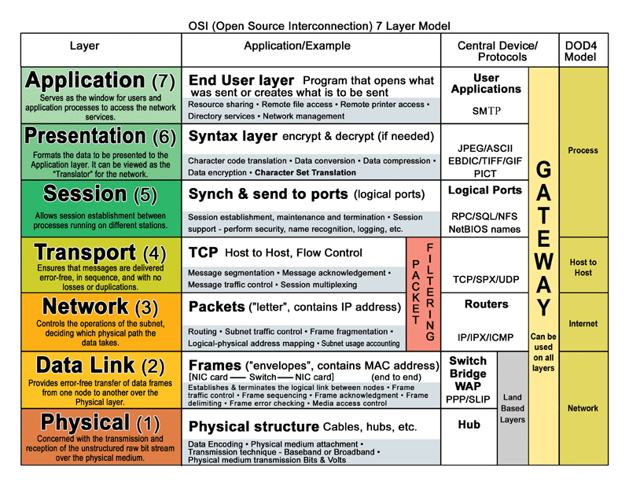
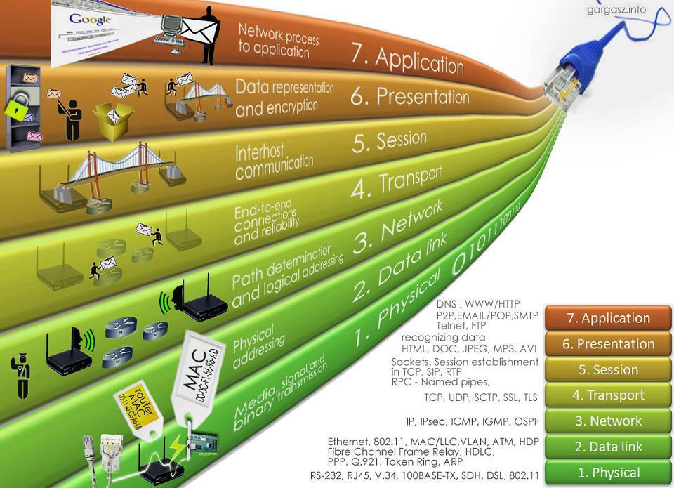
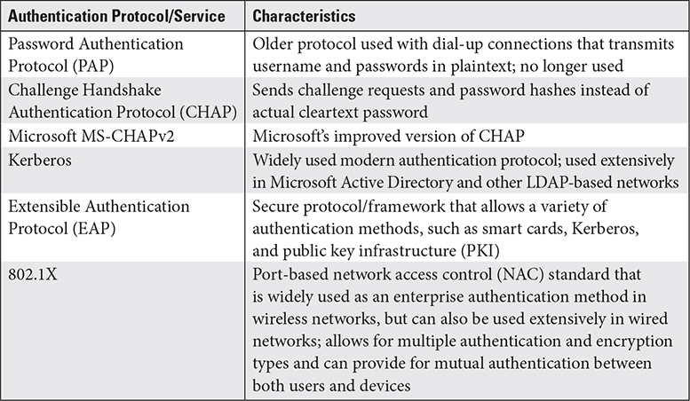
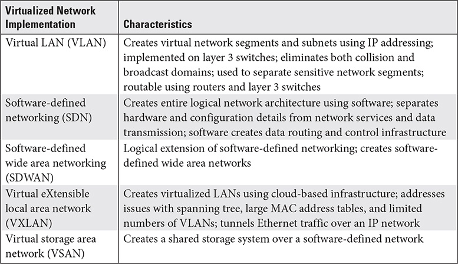
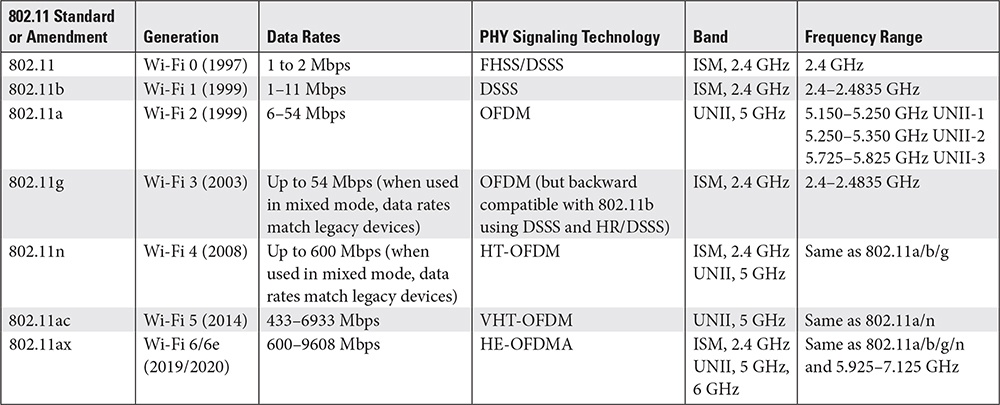
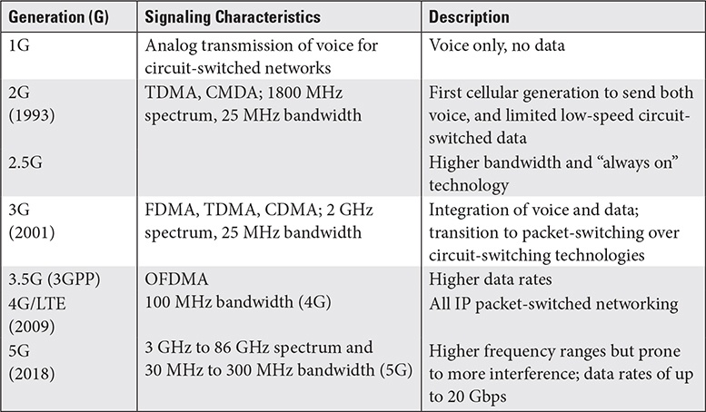
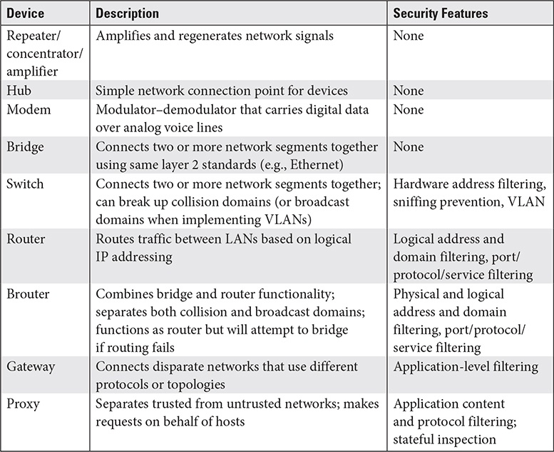
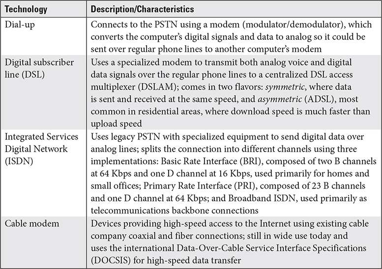
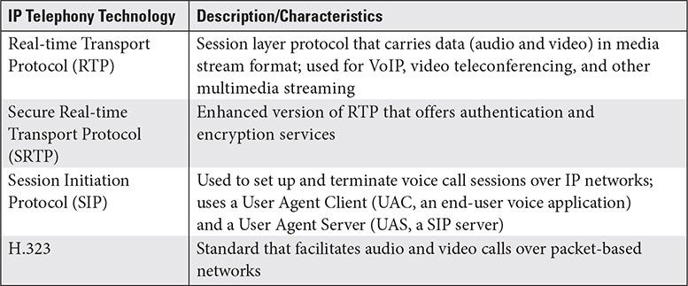
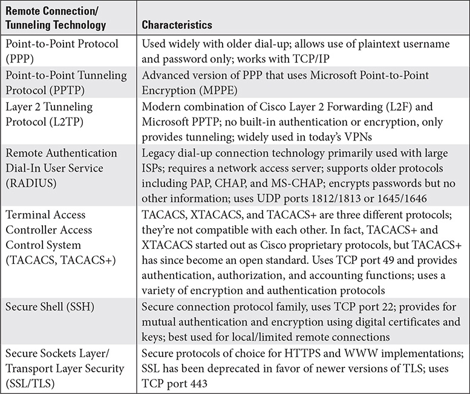

# CISSP Domain 4 - Communication and Network Security

## OSI-Model
* Data is transformed within each layer and is referred to as different protocol data units (PDU)
* Data passing down = encapsulated, Data passing up = de-encapsulated
* TCP/IP-Model is a practical implementation of the OSI model

## Procotols

### IP - Internet Protocol - Layer 3

* Provides routing services, logical addressing and routing
* IPv4 is the current version of IP used worldwide (32 bit)
* IPv6 is the next generation (128 bits), features address scoping, autoconfig, security and QoS

### ICMP - Internet Control Message Protocol - Layer 3

* Used to determine status of other hosts
* Ping, Traceroute and pathping are tools which uses ICMP echo requests

### IGMP - Internet Group Management Protocol - Layer 3

* Supports multicasting.
* Uses a specific IP Address Class D range which begins with 224.0.0.0 address space

### ARP - Adress Resolution Protocol - Layer 2

* Resolve a 32-bit IP to a 48-bit MAC.
* ARP poisoning is ARP cache is polluted with incorrect entries

### SSL, TLS, HTTPS

* POODLE affects all block ciphers that SSL uses.
* SSL 3.0 and lower have been deprecated since 2015
* TLS current version is 1.3 - supports only five encryption algorithms
* TLS supports server authentication and mutual authentication between client and server
  * TLS connection begins with "Hello" message that lists the cipher suites & request for key exchange
  * Server replies with its choice of cipher suites and secure protocols
  * Server sends digital certificate and a public key
  * Client sends back a secure session key
  * Optional step is the client authentication by sending the server his own certificate and pub-key

### IPSec - IPSecurity - Layer 3

* Is a protocol suite
* Can provide encryption and authentication services and secure key exchange
* Has four main protocols in the suite
  * Authentication Header (AH) - Auth services and data integrity
  * Encapsulating Security Payload (ESP) - Encryption services
  * Internet Security Association and Key Management Protocol (ISAKMP) - Security key association and key exchange
  * Internet Key Exchange (IKE) - Assists in key exchange between to entities
* Used to protect communications in one of two modes:
  * Transport mode - Can be used on local network and encrypts specific traffic but not the headers.
  * Tunnel mode - Is tunneled into another protocol (Layer 2 Tunneling Protocol - L2TP), and sent outside of local networks. Can protect both data and header information while in tunnel mode

### SSH - Secure Shell - Port 22 TCP - Layer 5+

* Used for remote access
* Can be used to protect nonsecure protocols such as FTP
* Secure Shell Version of FTP = SFTP
* Secure Copy Protocol = SCP
* FTP tunneled through SSH/TLS = FTPS

### EAP - Extensible Authentication Protocol

* Framework with multiple types of authentication methods for users and devices
* Can use many different authentication methods as passwords, tokens, biometrics, one-time pw (OTP), Kerberos, digital certificates ff.
* When two entities connect using EAP they negotiate a list of auth methods that are common to both
* Can be used over a variety of ohter protocols such as PPP, PPTP and L2TP, wired and wireless.
* Several different variants: EAP with TLS (EAP-TLS), pre-shared keys (EAP-PSK), tunneled TLS (EAP-TTLS) and version 2 of Internet Key Exchange (EAP-IKE2)
* Used extensively with 802.1X

### PEAP - Protected Extensible Authentication Protocol

* Extends EAP with protected channel for identity exchange
* Can be used in combination with TKIP (Temporal Key Integrity Protocol) to provide a temporal key

### IEEE 802.1X

* Port-based auth protocol for access control
* Three important components:
  * Supplicant - Client device
  * Authenticator - Infrastructure device connecting the client to the net and passing on auth requests
  * Authentication Server - Server containing authentication information, such as RADIUS or Kerberos
  * Can use a variety of auth methods

### Kerberos - Port 88 TCP
* Authenticate users to networks and resources
* Used in LDAP-Networks as a single Sign-on (SSO) technology.
* Authentication protocol in Windows Active Directory networks
* Uses a ticket-based system
* Is heavily time-based

## Multilayer Protocols

### Meanings

* Reside on more than one OSI Layer (ie SSH)
* Use both UDP and TCP (ie DNS, DHCP)
* Are monolithic in nature and span multiple layers

### Security considerations
* The layers
* The ports and transport type (TCP/UDP)
* The devices at the layers
* Encapsulation or encryption used
* Whether secure protocols are used

## Converged Protocols

### Fibre Channel over Ethernet (FCoE) - Layer 2
* Technology that allows storage area network (SAN) solution to function over Ethernet
* Operates at high speeds using the Fibre Channel protocol
* Requires specialized network equipment
* Fibre Channel operates over optical networks and has been enhanced to work over copper (Ethernet)
* Minimum speed of 10 Gbps
* A follow-on technology is Fibre Channel over IP (FCIP)

### Internet Small Computer Systems Interface (iSCSI) - Layer 3

* Storage technology based on IP
* Runs over standard network equipment and so not as expensive than FCoE
* Clients (initiators) send iSCSI commands to storage devices (targets)

### Voice over Internet Protocol (VoIP)

* For Voice-Calls over the Internet

## Micro-/Segmentation

* Segment networks to eliminate broadcast and collision domains
* Separate sensitive hosts and networks from general population
* Micro-Segmentation segments a single sensitive host or an application by using VLANs, Encryption of all traffic, different cabling, disconnecting altogether, virtualization

## Software-Defined Networking (SDN)

* Virtualization technology to control how traffic is forwarded
* Uses a software controller to handle traffic routing
* Allows quick network reconfiguration and provisioning
* Takes over control plane (updating routes) and forwarding plane (traffic forwarding decisions) functions
* SDN uses open standards and protocols and is vendor agnostic
* SD-WAN is the extension of SDN for geographically separated infrastructures

## Virtual eXtensible Local Area Network (VxLAN)

* Defined in RFC 7348 that encapsulates VLAN management traffic
* Encapsulates Layer 2 VLAN frames into UDP
* VLANs are limited to 4096 networks (due to 12-bit VID) but VxLAN expands that to over 16 million VLANs

## Wireless Technologies

* Fundamental radio frequency (RF) signal is a sine wave
* As the wave changes direction over a measured period of time it is known as a cycle. Cycle per second is frequency
* Frequencies are measured in hertz (Hz)
* Frequencies within a specific range are called the bandwidth (difference between upper and lower frequency)
* Waves can be changed (modulated) based on amplitude (height of the sine wave) or its frequency
* RF propagation suffers from many issues
  * Absorption (absorbed by material)
  * Refraction (bend by an object)
  * Reflection (reflected off an object)
  * Attenuation (signal weakening over time and distance)
  * Interference (noise interfering)
* Signal power is measured in watts (W)
* Use different signaling methods
  * Direct sequence spread spectrum (DSSS) - Uses entire frequency continously by attaching chipping codes
  * Frequency hopping spread spectrum (FHSS) - Uses portions of a band splitting it into smaller subchannels
  * Orthogonal frequency division multiplexing (OFDM) - digital modulation scheme that groups multiple modulated carriers together

### Wi-Fi
* Wi-Fi = Ad hoc network between to entities OR using Wireless Access Points (WAP)
* Using a WAP is known as infrastructure mode
* Devices attached to a WAP are Basic Service Set (BSS)
* Clients must be configured to use the correct Service Set Identifier (SSID) - the network name
* Devices must be on the same frequency band (channel) to connect and have the same security parameters
* Frequency bands for the 802.11 standards are
  * Industrial, Scientific and Medical (ISM) range of 900 MHz, 2.4 GHz and 5.8 GHz
  * Unlicensed National Information Infrastructure (UNII) band of 5.725 GHz to 5.875 GHz
* 802.11b uses DSSS instead of OFDM.
* Devices sold by manufacturers must comply with Wi-Fi Alliance standards to be certified by the body.

__Security__
* Protocols
  * WEP - Used weak IV and a problematic RC4 streaming cipher
  * WPA (Wi-Fi Alliance) - Allowed larger key sizes and implemented the Temporal Key Integrity Protocol (TKIP)
  * WPA2 (IEEE 802.11i) - Ability to use AES over TKIP, larger key sizes and better encryption methods
  * WPA3 (Wi-Fi Alliance) - Implement 802.11i and 802.1s (Simultaneous Authentication of Equals [SAE] exchange) and 802.11w (provides protection of management frames), Mandatory on all devices certified by the Wi-Fi Alliance after July 2020.
* Measures
  * Ensure password quality
  * Physically protect network equipment
  * Reduce transmitting power to only what is necessary
  * Don't rely on not broadcasting network's SSID and MAC-Filtering
  * Periodically change authenticators
  * Use enterprise-level mutual auth
  * Use port-based authentication (802.1X)
  * Scan network for rogue devices (evil twin attack)

### Bluetooth
* IEEE 802.15 standards helps to create Wireless Personal Area Networks (WPAN) between devices
* The connection process is called pairing. 
* Uses some of the frequencies used by 802.11 devices in 2.4 GHz range.
* Maximum range of 100 meters
* Bluetooth 5.3 is current version

__Attacks__
* Bluejacking - receiving unsolicited pairing requests to send unrequested messages
* Bluesnarfing - Request a bluetooth connections and if paired, read modify or delete information
* Prevented by making the device nondiscoverable and changing default factory code (PIN) - often 0000

Bluetooth Low Energy (BLE) is a version of Bluetooth designed for use in medical or IoT devices. Not compatible with Bluetooth.

### Zigbee
* IEEE 802.15.4
* Very low power and low data throughput. Very close proximity.
* Used for IoT applications and provides 128-bit encryption services
* Open trust model - All apps and devices on a zigbee network inherently trust each other
* Three keys
  * Network key - shared by all devices and used for broadcast messages
  * Link key - used for each pair of connected devices for unicast messages
  * Master key - Unique for each pair to establish key exchange
* Depends on a well-protected physical environment

### Satellite
* All points sending and receiving must be within satellite's direct line-of-sight
* Footprint is the satellites area of coverage
* Clients are called ground stations
* A transponder on the satellite transmits and receives signals
* Are in one of two types of orbits
  * Low Earth Orbit (LEO) - Distance between 99 and 1,245 miles, Used for cellular and internet providers
  * Geosynchronous satellites - Distance of 22,236 miles, "fixed", used for transatlantic communication, TV

### Li-Fi
* In beginning stages and not so prone to interference

### Cellular Networks
* Cell - Maximum transmission and receiving distance of a cellular tower and its base station. Hexagonal shape.
* Methods for multiple access of frequencies
  * Time division multiple access (TDMA) - Uses time slices
  * Code division multiple access (CDMA) - Use a frequency range by assigning unique codes
  * Frequency division multiple access (FDMA) - Range is divided into sub-bands or channels
  * Orthogonal frequency division multiple access (OFDMA) - Channels are subdivided tino closely spaces orthogonal frequencies.
* Modern mobile devices rely on at least a minimum of 4G (first tech to primarily use IP).
* Transmissions are encrypted between the device and the cell tower, but after this in clear text over wire

## Network Architecture

| Name | Description |
| :----- | :----- |
| Intranet | Private network, speparated from public internet or nontrusted networks. |
| Extranet | Specially segmented network to provide servcices for business partners. |
| DMZ | Perimeter network. |
| VLAN | Create virtual local area networks. |
| Bastion host | Hardened host that separates untrusted networks from sensitive ones. |

### Devices

### Firewalls

Next-generation firewalls (NGFW) are combination devices with features like proxing, IDS and NAC.

Types:
* Packet-filtering (static) - Filter on IP address, port, protocol; operates at Network Layer, called screening routers
* Circuit-level - Filter on session layer traffic rather than traffic content
* Application-layer - Filter on characteristics of applications, 2nd Gen FW, proxy firewall
* Stateful inspection - Filter on connection state, Layer 3&4, 3rd Gen FW

### Internet Connections

## Transmission Media Protections

### Wired

* Protect connection endpoints
* Cable away from general-use and high-traffic areas
* Secure cable behind walls, above ceilings and under the floor
* If a cable run is rarely used, disable switch ports that may connect to it
* Remove unused cable runs
* Label all cables on both ends with room number, drop number or unique ID. Labeling which end device the cable should be plugged into
* Have a formal diagram/documentation for all cabling runs
* Add additional protection to cabling that runs through physically vulnerable areas (break rooms, reception areas, high-traffic areas)
* Periodically inspect cabling for misuse or tampering

### Wireless

* Physically protect WAP
* Use strong auth and encryption mechanisma (WPA2/3, strong keys, 802.1X)
* Use only power levels needed to transmit
* Centrally locate WAP, not near windows, external walls or roofs
* Rename default SSID and use SSID hidiing
* Routinely monitor wireless access points
* Segregate guest and business wifi

## Secure Communication Channels

### Voice

Voice was used by plain old telephone service (POTS), with dial-up lines and dedicated circuits. This system was called public switched telephone network (PSTN) and used circuit-switching technology. If an organization had ist own internal system voice occured over Private Branch Exchange (PBX).

Security issues:

* Lax Administration an unrestricted access by anyone within the company
* Weak Authentication
* No encryption
* Vulnerabilities to attacks like war dialing, phone freaking, denial of service and spoofing
* Voice traffic has no built-in security protocols
* Is also referred to as Internet Protocol (IP) telephony
* SIP and H3.2 are competing standards and run on top of RTP to provice call initiation and setup

Measures:

* How will the organization make 911 calls?
* Backup communications like wireless or cellular capabilities or PSTN phone systems

### Multimedia Collaboration and Remote Access

* Voice and Video technologies require network traffic prioritization
* Remote Access
  * Dial-Up-Technologies: Serial Line Interface Protocol (SLIP) or Point-to-Point Protocol (PPP)
  * VPN
    * Client-to-site VPN - A single user connect to a corporate network through a concentrator
    * Site-to-site VPN - Connect multiple corporate LANs, local concentrator to remote concentrator

### Data Communications Terms

| Term | Description |
| :----- | :----- |
| Identification | Identiy thorugh username/password or MFA |
| Authentication | Authenticate to other entities |
| Authorization | Properly authorized entities are able to communicate |
| Encryption | Auth info and data should be encrypted |
| Data integrity | Cyclic redundancy checking (CRC), hashing |
| Nonrepudiation | Not be able to deny communications |
