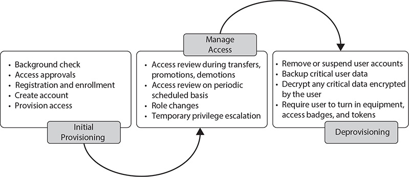
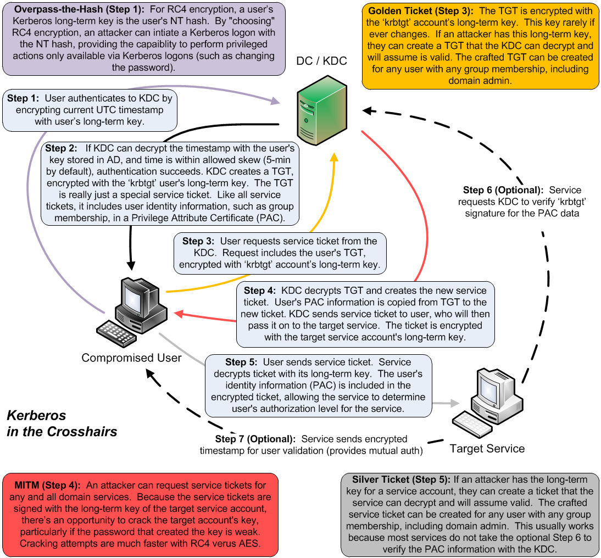
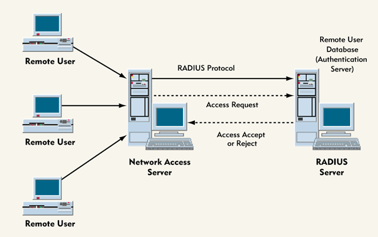

# CISSP Domain 5 - Identity and Access Management (IAM)

## Logical Access

* Identification and authentication mechanisma to validate and trust subjects
* Authorization (rights, permissions, privileges)
* Accountability controls (Auditing)
* Integrity mechanisms (Hashing)
* Strong encryption systems, algorithms, keys
* Nonrepudiation mechanisms (digital certificates)

## Identity management (IdM)

* Formalized ongoing process conducted for all entities accessing info systems of an organization
* Identities have to be managed throughout their life cycle. This includes creation, secure key and identity storage, updating, suspending, revoking

## Multifaktor authentification

* Also called "strong authentication"
* Faktors
  * I - Know
  * II - Have
  * III - Be
* Types
  * False Rejection Rate (FRR) == Type 1 Error - Du wirst abgelehnt, obwohl du korrekt bist.
  * False Acceptance Rate (FAR) == Type 2 Error - Du wirst zugelassen, obwohl du falsch bist.
* In addition there are other factors like Location or time of day
    
## Establishing for Identity

* Registration and identity proofing are precesses used to prove the identity of an individual as well as to register it
* Establishment of identity is to establish a chain of trust (i.e. get a passport by appear in person)
* Federated Identity Management (FIM) - Multiple Organisations use a single IdM provider
  * On-Premise - Mgmt-Control over IdM-Solution and resposibility for ist daily maintenance. Som thirs-party solutions can reside on-premise (Kerberos, Microsoft AD)
  * Cloud - IDaaS which provide identification, authorization and access management. Often used with SaaS. Might requre a Cloud access security broker (CASB)
  * Hybrid - integrate both solutions.

## Credential Management Systems
* Securely stores credentials and can be used to issue certificates (i.e. Active Directory) and inlcude administrative policies to manage credentials
* Activities
  * Password management
  * Password synchronization
  * Self-service password reset
  * Assisted password reset
* Single Sign-On (SSO)
  * Authenticate once and have access to multiple ressources
  * Done by technologies like Kerberos and Windows Active Directory or Federated identity Management
* Just-in-time (JIT) access
  * Only allowing access they need at the time they need it (runas, sudo)
        
## Authorization Key concepts

| Concept | Description |
| :----- | :----- |
| Security clearances | Levels of trust based on background checks for a level of sensitive information. |
| Need-to-know | Individual requires access to perform tasks by their job role. |
| Contrained interface | Assists in restricting the actions a subject can take by OS or App. |
| Content-dependent access | User are restricted based on the type of information that an object holds such as healthcare or financial informations. |
| Context-dependent access | Users must be in the correct environment and context (i.e. Jump box). |
| Permissions | Allowable actions like reading or writing. Object dependent. |
| Rights | Capabilities that entities have (restore backup data). Not necessarily object dependent. |
| Privileges | Catchall term for special actions - Actions or capabilities, that must be specifically granted. |
| Explicit permission | specifically identified or listed as allowable. |
| Implicit permission  | Implied or effective by default. |

## Authorization Models

__Discretionary Access Control (DAC)__

* Creator or owner of an object can assign permissions.
* Facebook photos viewed by "friends, all, nobody"
* Windows OS
* Can have rules imposed on users such as specific login hours or IP subnets

__Mandatory Access Control (MAC)__

Scurity Administrator must assign all access.

Requirements are:

* Security clearance level held by individual
* Need-to-know required by job position
* Explicit supervisor approval for access
* Security labels for objects that match security clearance.

__Role-Based Access Control (RBAC)__

* Security Administrator assigns all permissions, rights and privileges based on role or job function
* Objects associated with a role will inherit privileges.
* Kann leicht gemäß der Organisationsstruktur aufgebaut werden.
* Limited RBAC = Users werden Rollen in Applicationen zugewiesen
* Hybrid RBAC = Manchmal Rolle zu Application und bei manchen Applikationen die Applikationsrolle

__Rule-Based Access Control__

* Rules to grant access based on elements and conditions
* Who, When, what
* "Darfst nur zugreifen, wenn du in Deutschland bist"
* Firewalls and routers (traffic-filtering devices)
* Global Rules applied to all users

__Attribute-Based Access Control (ABAC)__

* Like Rule-based but much deeper level od detail
* Can be based on the subject or the object or a combination
* Commonly used in SDNs.

__Risk-Based Access Control__

* Adapts to the current situation and changing characteristics of system and environmental risk
* Applies a previously defined baseline of subject and object behaviour
* Can require users to authenticate with MFA because it ca evaluate how a user has logged on

## Identity and Access Provisioning Lifecycle

### Provisioning and Deprovisioning

All Activities to provide information services to personnel.

* Initial Provisioning
  * Background Check (verification of identity and citizenship, simple credit check, criminal background)
  * Qualification check (education, experience, certifications)
  * Human resource department functions
  * There should be a process in place to obtain approvals for access
  * IT department creates the user account and assigns the appropriate access to various resources
  * The user creation process is called registration or enrollment (assigning a unique identifier, provisioning authentication methods) in which the user is expected to sign acceptable use policies and non-disclosure agreements.
* Deprovisioning
  * Removing user accounts from systems and applications
  * Backup up any critical data that may have been owned by the user account
  * Decrypting any encrypted data the user may have
  * Requiring the user to turn in equipment, access badges, tokens and other identifiers
  * Suspending (not deleting) the user's accounts for a predetermined length of time.
  * As soon as the decision is made to terminate, their user account must be suspended
  * They should be escorted at all times by management or security
  * Immediately confiscate access tokens, badges, authenticators and equipment
  * Retirement/prolonged absence may not require immediate account termination but same procedure

### Role definition

* Should be defined and assigend when they are initially provisioned
* Continually updating role membership

### Privilege Escalation

* Privilege creep - User accumulates excessive privileges over a long time
* Additional privileges should be verified by a supervisor or decision-making authority
* Granting additional privileges should also be documented
* Temporary privilege escalation - Just-int-time (JIT) access like sudo or runas
* Managed services accounts - Account permissions should be reviewed and place it in restricted group

### Account Access Review

* In all changes review the user's access rights for their job function (event-based review)
* Also routinely and periodically review user/system/service accounts access rights. (periodic review)

## Authentication Systems

### Open Authorization (OAuth)

Open Standards authorization framework.

* Exchanges messages between the API's of apps (Desktop, mobil, web) and creates a temporary token.
* OAuth 1.0 Is only used for AUTHORIZATION not authentication
* OAuth 2.0 roles
  * Resource Owner - Grants access to ressources
  * Resource Server - Provides the protected Resources.
  * Client - Wants to access ressources
  * Authorization server - Generates access-Tokens

### OpenID

Authentication framework.

### OpenID Connect (OIDC)

Open authentication standard by the OpenID Foundation.

* Set of credentials is maintained by a third-party identitiy provider (IdP/OpenID provider)
* A user must enter their OpenID credentials, which in turn causes the website and the OpenID provider  to exchange authentication information.
* Uses JSON Web Token (JWT).

### Security Assertion Markup Language (SAML)

XML-based language used to allow identity providers to exchange auth infos.

* Uses XML-based messages, called SAML assertions
* Three components:
  * The "principal" - The user requesting access
  * The identity provider - Entity that authenticates the user's identity
  * The service provider - Entity who owns or controls the service or application

### Kerberos

* Open-standards authentication protocol
* Provides SSO and end-to-end secure authentication services
* It generates authentication tokens, called tickets, which are securely issued to users

__Components__

| Components | Description |
| :----- | :----- |
| Key Distribution Center (KDC) | Primary component. Stores koeys and provides authentication and key distribution services. In Microsoft Active Directory, a domain controller serves as KDC. |
| Principal | Is any entity that KDC has an account for. |
| Tickets | Are timebased session keys and issued by the KDC. Used by principals to access resources. |
| Realm | Konsists of all the security principals for which the KDC provides services. In Microsoft this realm is an Active Directory domain. |
| Authentication Service (AS) | Authenticates pricipals when they log on to the realm. On KDC. |
| Ticket granting service (TGS) | Generates session tickets that are provided to security principals. |

__Authentication process__

1. User authenticates by logging into a domain host.
   1. Host sends the username to the AS.
   2.  KDC sends the user a TGT, which is encrypted with the secret key of TGS
2. If user has a correct PW, the TGT is decrypted. User gets access to device.
3. If a network ressource should be entered, the host sends the TGT to the TGS to access the ressource
4. TGS creates and sends an encrypted session ticket back to the user to authenticate the ressource
5. Host decrypts ST and sends it to the resource for authentication
6. If the resource is able to authenticate that the ticket came from both user and KDC, then access okay

Authentication and ticket distribution are highly dependet upon system time synchronization in a realm.

KDC timestamps all tickets and must have access to a valid time source such as a NTP server.

__Weaknesses__

* Single-point-of-failure and must be scalable
* Weak keys, such as passwords are vulnerable to attack
* Secret keys are temporarily stored on user devices

## Authentication, Authorization and Auditing/Accounting (AAA) protocols

### RADIUS - Remote Authentication Dial-In User Service

* UDP 1812,1813
* Remote connections into networks
* Uses a network access server for dial-in
* Offloads authentication services to internal credential databases
* Supports many of the older auth protocols such as PAP, CHAP and MS-CHAP
* Can encrypt passwords but nothing else
* Requires more overhead since it relies on UDP and must error check therefore

### TACACS - Terminal Access Controller Access Control System

* TCP 49
* TACACS+, TACACS and XTACACS are three different protocols
* TACACS comibites Authentication and Authorization
* XTACACS separates Authentication, Authorization and Accounting
* TACACS+ supports MFA

### Diameter

* Provides more flexibility that RADIUS or TACACS
* Is a peer-to-peer protocol where either endpoint can initiate communications
* Is not backward compatible with RADIUS
            
