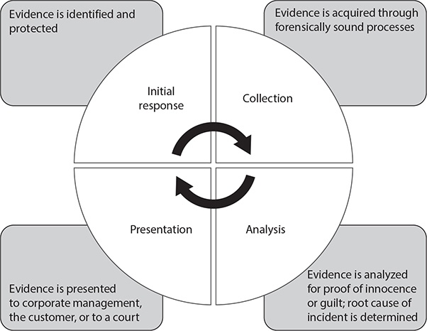
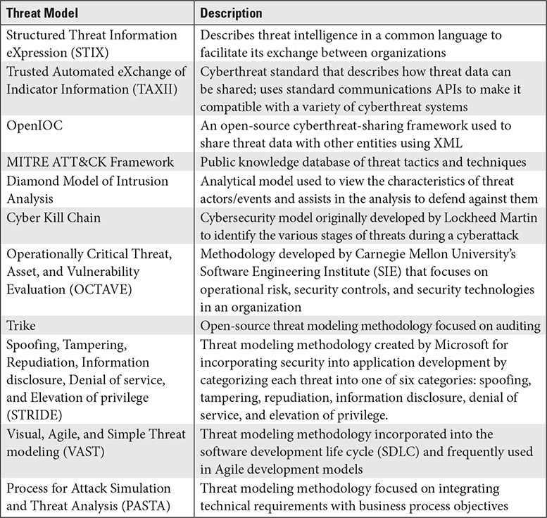
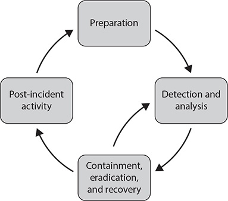

# CISSP Domain 7 - Security Operations

## Dealing with Evidence

### Evidence preservation

* Proper collection and handling
* Chain of custody - Form, that describes the evidence
  * Documents time and location
  * Who collected it, and its transfer
  *  Every individual who takes possessing, relocates it or pulls it out of storage for analysis
* Physical protection
* Logical protection

### Evidence Life cycle

| Nr. | Step | Description |
| :----- | :----- | :----- |
| 1. | Initial response | Evidence is identified and protected, CoC initiated. |
| 2. | Collection | Acquiring through forensically sound processes, preserve integrity. |
| 3. | Analysis | Analyzed at the technical level, determining innocence or guilt is the goal as well as identifiying the root cause of the incident. |
| 4. | Presentation | Summarize evidence in the correct format. |

### Collection and Handling procedures

* Secure the crime scene against unauthorized personnel.
* Photograph the scene before it is disturbed in any way.
* Don't power off devices until any live evidence has been gathered.
* Obtain legal authorization from law enforcement/asset owner before removing items from the scene.
* Inventory all items removed from the scene.
* Transport and store all evidence items in protected containers and store them in secure areas.
* Maintain a strong chain of custody at all times.
* Don't perform a forensic analysis on original evidence items; duplicate them.
* Legal hold ensures that any devices must be kept in secure storage and access must be controlled Cannot be reused, destroyed or released until cleared by a legal department or court.

## Digital Forensics Tools, Tactics and Procedures

### Needed experience

* Data acquisition from volatile memory or hard drives
* Establishing and maintaining evidence integrity through hashing tools
* Data carving to locate and preserve artifacts, that have been deleted or hidden

### Forensic tool set

* Should be standardized and thoroughly documented.
* An organization should have established procedures to follow when using a tool.
* By professional organizations or national standards agencies validated tools should be preferred.
* Should offer repeatable and verifiable results.

### Tool types

* Network tools (wireshark, tcpdump)
* System tools (Obtain technical configuration informations)
* File analysis tools
* Storage media imaging tools
* Log aggregation and analysis tools
* Memory acquisition and analysis
* Mobile device forensics tools

## Investigative techniques

* Primary tasks
  * Collecting and preserving all evidence.
  * Determining the timeline and sequence of events.
  * Determining the root cause and methods used.
  * Performing a technical analysis of evidence.
  * Submitting a complete, comprehensive, unbiased report.
* Key points
  * Treat all investigations as if the results will be presented in a court.
  * Remain unbiased.
  * Always have another investigator validate work.
  * Maintain documented, verifiable forensic procedures.
  * Keep all investigation information confidential.
  * Only perform procedures that you are trained and qualified to perform.
  * Ensure you have the proper tools.

## Reporting and Documentation

__Includes:__

* Executive summary
* All actions involving evidence and witness (Chain of custody, artifacts collected, witness interviews)
* Dates, times, and relevant events
* Determination of the root cause, attack methods and assertion of proof of guilt or innocence
* All forensic analysis of evidence

__Reports are delievered to:__

* Corporate legal department
* Human resources
* Lawyers
* Law enforcement investigators

__Characteristics:__

* Clear, concise and nontechnical
* Well written and well researched
* Answers who, what, where, when, why and how
* Conclusions supported by evidence
* Unbiased analysis

## Forensics

### Types of evidence

| Type | Description |
| :----- | :----- |
| Direct evidence | Oral or written testimony of an eyewitness that proves or disproves a particular fact or issue. |
| Reas (physical) evidence | Tangible items of the actual crime. May also include video or audio surveillance tapes made during or after the event. |
| Documentary evidence | Originals and copies of business records, computer-generated and computer-stored records, manuals, policies, standards, procedures and log files. In fact, most of the evidence presented in a computer crime case is documentary evidence. |
| Demonstrative evidence | Used to help the court understand a case. Opinions are considered demonstrative evidence and can be either expert or non-expert. |

### Rules

| Rule | Description |
| :----- | :----- |
| Authentic | The forensic examiner must be responsible for the origin of the evidence. |
| Accurate | The techniques used and evidence collected must not call into question the authenticity of the evidence. |
| Complete | Be clear and complete and should reflect the whole story. |
| Convincing | What procedures they used and how the integrity of the evidence was maintained. |
| Admissible | Legal way to obtain the proof. |

## Monitoring

* Types - Security, Performance, Function, user behavior
* Purpose is to take proactive measures to defend the network
* Log types - Firewall, Proxy, ID/PS - review on a daily basis
* Continous Monitoring of network, hosts and anomalies as well as system and organizational risk

### Key elements to monitor

* Network devices and their performance
* Servers
* Endpoint security
* Bandwidth utilization and network traffic
* User behavior
* Infrastructure changes or departures from normal baselines

### Intrusion detection and prevention

Can take actions to halt traffic by dynamically rerouting network traffic, shunting connections, isolating hosts.

One of three models:

| Model | Description |
| :----- | :----- |
| Signature or pattern based (rule-based) | Signatures match attack patterns. |
| Anomaly or behavior-based analysis | Detects deviations in normal behavior baselines. |
| Heuristic | Detects deviations, but matches those to potential attack characteristics. Looking to see what abnormal behaviors might do, such as accessing system files or writing data. |

### Security Information and Event Management (SIEM)

* Process of collecting, aggregating, correlating and analyzing
* Central data collection point for all log files, traffic captures and other forms of data
* Helps to make intelligent, risk-based decisions

__Types:__
* Can be used as a Managed Service Security Provider (MSSP) who also looks after it.
* Self-Hosted, self-managed
* Cloud SIEM, self Managed
* Hybrid self-hosted (Hosts on Site aber betrieben durch MSSP)
* SIEM as a Service - Alles bei einem Dritten

### Egress monitoring

* Examines traffic, that is leaving the network
* Typically performed by firewall, proxy, intrusion detection or data loss prevention systems
* Looks for signs that internal hosts have been compromised and are being controlled by an external malicious entity and are communicating with it.
* Useful for detecting data exfiltration by DLP or large volumes of data identified by a firewall as well as particular extensions, sizes and other characteristics.

## Log management

* Logs are automatically sent to central collection points like SIEM or syslog server
* Often manual log review must occur to solve a particular problem
* Event logs consists of:
    * Event definition
    * System or resource the event effects
    * Identifying information for a host (name, IP, MAC)
    * The entity that initiated or caused the event
    * Date, time and duration
    * Action (e.g. file deletion, privilege use …)

## Threat Intelligence

Identify potential or actual threats to the organization - By determining threat trends, historical analysis of threat data or behavioral analysis.

### TI Terms

| Model | Description |
| :----- | :----- |
| Threat data | raw pieces of information. |
| Threat intelligence | Analyzed and correlated threat data put into context. |
| Threat feeds | Threat intelligence that come from sources like open-source, proprietary and closed-source. |

### Characteristics of Threat Intelligence

* Timeliness - Must be obtained as soon as it is needed
* Accuracy - Factually correct, not contribute to false positive or negative
* Relevance - Related to the given threat problem
* Threat rating - Threat's potential danger level
* Confidence level - Trust in the TI source

### Types of TI

| Type | Description |
| :----- | :----- |
| Open-Source Intelligence (OSINT) | TI from public sources. May not apply to particular assets, comes in great volumes, which must be reduced, sorted and prioritized. |
| Closed-Source Intelligence | From governments or other parties. Not readily available to public. Is more accurate, more thoroughly authenticated, higher confidence level. Greater detail. |
| Proprietary Intelligence | Developed by private organizations and is sold. Sometimes tailored to the specific market. |
| Threat Hunting | Active effort to determine whether various threats exists in an infrastructure. Uses TI and Threat Modeling to make a look for specific threats in the network. |

### Threat Modeling Technologies

| Name | Description |
| :----- | :----- |
| STIX | TI language. |
| TAXII | Describes how threat data can be shared, API's. |
| OpenIOC | Cyberthreat-sharing framework (XML). |
| MITRE ATT&CK Framework | Public knowledge DB for TTPs. |
| Diamond Model of Intrusion analysis | Analytic model. |
| Cyber Kill Chain | Cybersecurity model. |
| OCTAVE | Developed by Carnegie Mellon Universities Software Engineering Institute (SIE) that focuses on operational risk, security controls and security technologies. |
| Trike | Open-source TM methodology focused on auditing. |
| STRIDE | Microsoft TM methodology. |
| VAST | TM methodology incorporated into SDLC. |
| PASTA | TM methodology focused on integrating technical requirements with business process objectives. |

### UEBA - User and Entity Behavior Analytics

* Focuses on patterns of behavior from users, accounts and processes
* Looks if user behavioral patterns change like login/logout time, which ressources they access

### Indicators of Compromise (IoCs)

* User is violating a policy or doing something illegal
* System itself is functioning but performing in a less than optimal manner
* System is under attack from a malicious entity

## Configuration Management

### Provisioning

* Initial installation and configuration of a system
* Manual installation of OS and Apps as well as changing configuration settings
* Often uses baseline images, which are preapproved configurations

### Baselining

* Ensuring, that the configuration of a system is set according to established organizational standards
* Changing baselines is part of the change management process
* An organization could have several established baselines that apply to specific hosts
* Baseline configurations should be documented and checked periodically
* Configuration settings
  * Standardized versions of OS and Apps
  * Secure configuration settings like allowed ports, protocols and services
  * Change of default account and password settings
  * Removal of unused applications and services
  * OS system and app patching

### Automating the Configuration Management Process

* Active Directory Group policy settings
* Customized Scripts with PowerShell or Python
* Enterprise-level management systems
* Advantages:
  * Reduce issues caused by human error
  * Ensure standardization
  * Make configuration changes much more efficient
* Security Orchestration, Automation and response (SOAR)

## Foundational security operations concepts

### Need-to-know

* Restrictive permissions, rights and privileges
* Need to keep privacy information confidential
* Should be carefully considered and approved by authority (supervisor, data owner, senior manager)
* Should periodically reviewed
* Revoke access if it is no longer required

### Principle of least privilege

* If someone has access to system or information (need-to-know), they can only perform certain actions
* Perform tasks at the minimal level necessary

### Separation of Duties and Responsibilities

* Prevents a single individual from performing a critical function that may cause damage to the organization
* Multiperson-control - Action or task requires more than one person acting jointly (e.g. sign and countersign a document)
* Collusion - Two persons secretly agree to commit a crime
* M-of-N control - doesn't require all designated individuals to be present to perform a task. You could say M OUT OF N people are needed.

### Privileged account management

* Privileged accounts should be approved by the management chain.
* Individual should have proper need-to-know, security cleareance as well as additional training
* Still should only have necessary privileges
* Only use these privileged accounts only for a limited amount of time and then log out
* Lends itself to RBAC - but then with more frequent auditing and to a greater level of detail

### Job rotation

* Rotates employees periodically through various positions so that an individual in not long enough to conduct fraud or other malicious acts
* Is a detective an deterrent control because the next person is able to discover wrongdoing
* Then carefully planned periodic cross-training is necessary
* An organization should never depend on one person only to perform a job function
* Mandatory vacations - Step away from the job position to take rest or to perform an investigation

### Service Level Agreements

* Agreement that ensure consistent levels of function and performance
* Specifies the responsibilities of both parties
* Failing to meet SLA requirements often incurs a financial penalty

## Media Management and Protection

### Media protection and use policy

* Data residing on media should be protected at the highest level of sensitivity dictated by the policy
* All media must be maintained under inventory control procedures and secured in storage, trans and use
* Proper access controls such as object permissions
* Only authorized portable media should be used and portable media must be encrypted
* Media should only be reused if sensitive data can be adequately wiped from it
* Media should be considered for destruction if it cannot be reused

### Media Protection techniques

__Media access controls__

* Sensitive data stored on media should be encrypted
* Access control permissions based upon job duties and nee-to-know, least priv and SoD
* Strong authentication mechanisms even for authorized users

__Media storage and transportation__

* Secure media storage areas (locked closets and rooms)
  * Physical ACL's
  * Proper temperature and humidity controls
  * Media inventory and accountability systems
* Proper labeling of all media
  * Point-of-contact information
  * Sensitivity Level
  * Archival or backup date
  * Special handling instructions
* Two-person integrity for transporting media (requiring two people)

__Sanitization and Destruction__

* Media should be kept only as long as it is needed
* Often media can be sanitized or cleared for reuse but in certain circumstances it must be destroyed
  * Wiping - Writing set patterns of ones and zeros to the media to overwrite data
  * Clearing - Wiping or overwriting with zeroes or ones
  * Purging/Sanitizing -  Stronger permanent method that can include methods such as sanitizing or degaussing, Data is not considered recoverable by any known methods

__Media destruction methods (reference NIST 800-88r1):__

* Degaussing
* Burning
* Pulverizing
* Physical destruction using hammers
* Encrypt the drive an destroy the key

__Dealing with different types of devices__

| Device type | Clear | Purge | Destroy |
| :----- | :-----: | :-----: | :-----: |
| Floppies | Overwrite | Degauss | Burning or Shred |
| HDD | Overwrite once or multiple times | Sanitize, Crypto-Erase, Degauss | Shred, Disintegrate, Pulverize, Burn |
| Non-Magnetic (SSD/USB) | Overwrite (2x) | Crypto-Erase | Physical destruction or a combination of overwriting, purging and encryption |
| Tapes | Overwrite | Degaussing for clearing if you want to reuse it | Burn |
| DRAM | Removing Power & Battery | Removing Power & Battery | Removing Power & Battery |Shred, Disintegrate, Pulverize, Burn |
| EAPROM, EEPROM | Full chip purge as manufacturer says | Full chip purge as manufacturer says | Shred, Disintegrate, Pulverize, Burn |

## Security Incident Management

Incident = An event with negative consequences for the organization
Security Incident = An event that affect the CIA

### Life cycle (NIST SP 800-61r2 - Computer Security Incident Handling Guide)

* Preparation
  * NOT part of the formal CISSP exam objectives for incident management
  * Having all the correct processes in place as well as supporting procedures, equipment, personnel…
  * Development of the IR strategy, policy, plan and procedures
  * Staffing and training a qualified team
  * Providing facilities, equipment and supplies for the IR capability
  * Processes
    * Incident definition and classification
    * Communication procedures, alerting, escalation, communications with stakeholders
    * Incident triage, prioritization and escalation
    * Analysis
    * Attack containment
    * Recovery procedures
    * Damage mitigation and remediation
* Detection
  * Should be included as a normal part of the infrastructure, architecture and design
  * IDS/IPS, alarms, auditing mechanisms which must be tuned
  * Detection comes from Anti-Malware apps, device and app logs, IDS alerts, user awareness
* Response
  * Triage if it is a false positive and determine its scope and impact
  * Notify IR team and escalate to upper management and outside agencies and in case disaster team
  * Decision to notify outside agencies must come from a senior manager
  * A call tree is often activated to ensure that team members get notified quickly
  * IR team gathers data and analyze the cause of the incident, scope and what the incident is affecting
  * Contain the incident and find the source
  * Gather and preserve forensic evidence and trace the incident back to its root cause
  * Initial response is not considered complete until the incident is contained and halted
* Mitigation (Schadensbegrenzung)
  * Implement temporary measures (shutting down systems, rerouting networks and halting processes)
  * Implement permanent measures have to be considered
  * Corrective controls = temporary in nature
  * Compensating controls = longer-term in nature
* Reporting
  * Reports of the status, efforts to contain and eradicate are communicated up and down the chain and laterally to other departments
  * Reporting to external third parties may occur, such as law enforcement, customers, stakeholders
  * Types: E-Mail, Calls, Press conferences or summary reports
  * Post-incident reporting
    * More formal and comprehensive
    * Normally takes place after the remediation
    * Normally nontechnical but technical appendices
    * Includes
      * Root-Cause analysis
      * Responses action
      * Timeframe
      * Mitigations put in place
      * Recommendations to prevent
* Recovery
  * Restore systems and data and bring business back online
  * Tests the effectiveness of the organization's BCP
* Remediation
  * Long-term mitigations that repair the damage (system replacement, data recovery, new solutions)
  * Develop a plan to remediate issues that causes the incident
  * Perform an updated risk assessment and analysis
  * Management must recommit to providing resources
* Lessons learned
  * Perform in-depth analysis why the incident occurred, what could have prevented it, what must be done in the future
  * Should be included in the final report
  * Improvements:
    * Response time - Detection, Notification, escalation and response
    * Deployment of resources - People, equipment and time
    * Personnel staffing and training
    * IR policy, plan and procedures

## Allow- and Deny-Listing

| Name | Description |
| :----- | :----- |
| Allow-Listing/Whitelisting | Allows only items in that rule to be processed. All other are default-denied |
| Deny-Listing/Blacklisting | All the elements are denied. Anything not in the rule set is default-allowed |
| Rule-set | Collection of rules that uses allow and deny action based on content items |
| Access-Control-Lists (ACL) | Normally associated with network devices and traffic |
| Explicit | Actual entries  in an list |
| Implicit | Not listed but by implication allowed or denied |

## Firewalls

A Firewall will be typically be on the network perimeter, called "Network-Based Firewall" or on a single host, called host-based firewall. It allows or denies access based on rules and divides networks into segments. Most famous is the Demilitarized zone (DMZ) or screened subnet architecture which is the network segment between an organisations production networks and untrusted networks like the internet.

There are different types of firewalls based on their capabilities, functions and features.

### Packet-Filtering/Static firewalls

* Filter based on traffic characteristics as IP/Address/Port or protocol
* At the network layer
* Also known as screening routers
* 1st Gen firewalls

### Circuit-Level firewalls

* Filter session layer traffic based on the end-to-end communcation sessions rather than traffic content

### Application-Layer firewalls

* Based on characteristics of applications
* At the application layer
* Also known as proxy firewalls
* 2nd Gen firewalls

### Stateful inspection firewalls

* Based on connection state of the inbound and outbound network traffic, state of established conns
* At layers 3 and 4
* 3rd Gen firewalls

### Next-generation firewalls (NGFW)

* Multifunctional devices that incorporate firewall, proxy and IDS/IPS services
* Based on any combination of all the techniques of other firewalls, including Deep packet inspection (DPI), connection state and basic TCP/IP characteristics
* At multiple layers but primarily at layer 7

### Web Application Firewalls (WAF)

* Protect web application servers from web-based attacks
* Can also perform other functions including authentication and authorization

### Cloud-Based Firewalls

* Firewall as a Service (FWaaS)
* Can greatly simplify management of the security infrastructure

## IDS/IPS

* IDS focused on simply detecting potentially harmful events
* IPS prevent intrusions by dynamically rerouting traffic of by making allow or deny decisions
* IDS/IPS have merged and become integrated
* IDS/IPS is placed inline within the network infrastructure
* Categories
  * Network-based - Looks ant network traffic entering/exiting an infrastructure or between hosts
  * Host-based - Looks at traffic entering/exiting a specific host, installed as software, most modern soluations are agent-based, centrally managed systems

## Third-Party provided security services

Managed security services (MSS) are security related services which are outsources to a third-party. For example, instead of building and maintaining a SIEM/SOC-Infrastructure by the organisation itself it can hand over this task to a specialized provider.

* Advantages:
  * Cost savings
  * Risk sharing
* Disadvantages:
  * Less control over the infrastructure
  * Legal liability (organization still retains ultimate resposibility)
  * Lack of visibility into the service provider's infrastructure
* Key is the SLA

## Other security technologies

### Honeypots & Honeynets

* Intentionally vulnerable host, segregated from the live network
* Honeynet is a network of honeypots that can simulate an entire network
* If implemented improperly it can cause legal issues for an organization
* Consult with legal department before deploying honeypot technologies

### Anti-malware

* Commodity malware (commercial or COTS) - Malicious entities obtain it online
* Polymorphic malware - Mutates in the wild
* Advanced malware - Produced by advanced criminals or nation-states
* Methods
  * Signature or pattern based detection
  * Behavior analysis or heuristic detection
  * Reputation-based services - Based on what other have seen the code do (reputation score)

### Sandboxing

* Protected environment within which an administrator can execute unknown software
* Can be a protected area of memory, a virtual machine, an application container or full physical host
* Also been known as detonation chambers - Media with unknown executables are inserted and started
* Bit-flipping is a way to changing pattern of the malware

### Machine Learning and Artificial Intelligence

* Can assist in analyzing very large heterogenous datasets
* Can be used for historical data as well as for predictive methods to determine trends or threats
            
## Patch and Vulnerability Management

* Organizations policies must address vulnerability management based on system ciritcality and vulnerability severity, including a patch management schedule, and address how to test patches
* Technical vulnerabilities are usually detected during vulnerability scanning 
* Criticality of the system and the patch are a key concern
* Patches should be applied as soon as possible but be prioritized according to the criticality
* Patch and vulnerability management policy should indicate a schedule based on criticality
  * Critical - One business day
  * Routine - One week (7d)
* Urgent patch after thorough research and ensuring the patch can be rolled back quickly
* Patches are related to configuration management with documenting changes to the official baseline
* All patches should be documented.

## Change Management

Includes how changes are introduced into the infrastructure, testing and approval process.

### Types

* Software and hardware changes
* Significant architecture or design changes to the network
* Security or risk issues requiring changes

### Processes

* Begins with policy that specifies individual roles
* Formalizes the change management program
* Creating a change management cycle
* Defining change levels
* Creating a change control board

### Change Management Board (CMB)

* Group tasked with overseeing infrastructure changes
* Also names Change control Board (CCB) or Change advisory board (CAB)
* Members are appointed by the organizations senior management
* Come from Management, IT, security and various functional areas
* Ensures, that changes are formally requested, tested, approved and implemented
* Often created by a document known as a charter which establishes the various roles and duties

### Life cycle

* Identify the need for change
* Request the change
* Testing approval
* Implement the change
* Post-change activities - documenting, monitoring, updating risk assessments, rolling back if needed

### Change levels

* Emergency or urgent changes - Must be made immediately
* Critical changes - As soon as possible
* Important - As soon as practical but planned
* Routine - Daily or monthly basis like noncritical patching

### Security considerations

* Any change introduce a degree of risk
* Perform vulnerability testing before and after a change
* Affected systems should be "frozen" or locked in configuration
* You need a backup plan if the change does not go as planned

## Recovery strategies

### Backup Storage Strategies Factors

* How much data can the organization afford to lose?
* How much data it requires to restore its processing capability?
* How fast it requires the data to be restored?
* How much the backup method or system cost?
* How efficient it's network and Internet connection are in speed and bandwidth?

### Traditional Backup strategies

| Strategy | Procedure | Issues | Restore | Archive Bit
| :----- | :----- | :----- | :----- | :----- |
| Full backup | Entire hard disk is backed up. | Backup takes much longer. Requires a great deal of storage space. | Full restore. | No archive bit |
| Incremental backup | Only the amount of data that has changed. | Data restore time can take longer. | Last full backup and each incremental backup since last full backup to be restored. | Resets the bit on a backup file (if set to on, this means it has not been backed up). |
| Differential backup | Only data that has changed since last full or incremental backup. Subsequent Backup includes all previous changed data. | Differential backups become larger and larger. | Only last full backup and last differential backup have to be restored. | Does not turn of the archive bit. |

### Storage types

__Direct attached storage__

* Least dependable, because it is unreliable and susceptible to accidents, damage and theft
* May be effective as a secondary means of backup for individual user workstations or small datasets

__Network attached storage (NAS)__

* Network enabled storage device which is directly accessible or managed by a server
* Suffers from some of the reliability issues as direct-attached storage
* May be sufficient for small to medium-sized businesses

__Redundant arrays of inexpensive disks (RAID)__

* RAID 0: Striping - Higher throughput, Minimum 2 disks
* RAID 1: Mirroring - Redundancy, Minimum 2 disks
* RAID 3: Byte-Level striping with parity-bit, Minimum 3 disks
* RAID 4: Block-Level (chunks) striping with parity bit, Minimum 3 disks
* RAID 5: Striping plus redundancy plus parity, Minimum 3 disks

__Storage Area Network (SAN)__

* Own cluster of management servers and security devices
* Often built for redundancy by having multiple storage devices that fail over each other
* Works with high-speed fiber connections
* Damage to the facility can also damage the SAN

__Cloud Storage__

* Supports large-scale data recovery that is fast and reliable
* Associated costs may increase with the amount of data as well as availability of bandwidth

__Offline Storage__

* Backed up and stored off the network and/or at a remote location
* Traditionally, organizations manually transported backup media to another site
* Malware infection is far less likely to impact the offline storage

__Electronic Vaulting and Remote Journaling__

* Backups can also be performed on individual files or transactions
* Electronic vaulting - Backup method where entire data files are transmitted in batch mode
* Remote journaling - Only sends changes to files in either near or actual real time

## Recovery sites strategies

### Considerable issues

* Costs and resources
* How easy is the activation of the recovery site?
* Potential level of damage or destruction
* Possible size of the area affected by a disaster
* Nature of the disaster
* Availability of public infrastructure
* Government-imposed requirements

### Types

* Cold site - Empty space in a facility
* Warm site - Equipped, has Internet and phone access already turned on, spares or redundant equipment has already be staged at the facility
* Hot site - Is ready for transition within a matter of minutes or hours, has all utilities and equipment: Receives data transfers quick or in real-time and therefore needs a high-speed Internet connection
* Reciprocal site - Agreement with another organization to share resources in a disaster
* Cloud site - As cloud service
* Mobile site - Built into a large van, a bus or transfer truck. Gives leadership and key personnel the ability to work together from a physical "command post". Are considered miniature hot sites.

## Disaster recovery (DR)

Focused foremost on saving lives and preventing harm to individuals, second is saving equipment.

### Key elements

* Establish solid emergency procedures
* Be prepared with proper lifesaving and emergency safety equipment as well as options to triage injuries and transport people to the closest medical facility
* Training personnel

### The Disaster Recovery plan (DRP)

* Criteria for declaring a disaster
* Preserving human lives and ensuring personnel safety
* Procedures for activating the disaster recovery team
* Communication strategies for all critical personnel
* Lines of authority and responsibilities
* Procedures for assessing damage and recoverability of assets
* Processes for initiating business continuity activities
* Exercising contingency plans

### Response

* Steps for declaring a disaster
* Activating the response team
* Determining safety and status of all personnel
* Establishing communications and command structure
* Damage assessment
* Recovering or salvaging equipment
* Establishing alternate facilities
* Restoring utilities as power, water, heat and comms
* Implementing business continuity efforts

### Communication plan

* Should dictate primary and alternate communications personnel who will pass Informations
* Radios are excellent contingency communications methods
* Runners are designated personnel to send them to relay information
* Up and down management chain, laterally across the organization and with external stakeholders

### Assessment

* Precedes recovery and BC
* Determining
  * Safety of facilities for return
  * Viability of Equipment and systems for functionality
  * If damage can be repaired
  * Whether any data is intact
  * Is utilities are still functional or present
* Go as soon as conditions permit but wait until conditions are safe or stable
* Some determinations may require outside expertise

### Restoration

* Getting and organization from the point of being damaged to a point where it is ready to begin business
* Goal is to restore the environment to a condition in which personnel can safely resume

### Training and Awareness

* Minimal level of training for everyone
* Some with DR responsibilities receive more training
* Classroom training as well as exercising the DR plan is of critical importance

### Lessons learned

Document as soon as possible.

## Testing disaster recovery plans

* Every organization should test its DRP on a periodic basis, at least annualy
* Test - Determining if a particular task, actually works as planned
* Exercise - Performing a programmed series of tasks that have been tested to gain experience and insight

### Types of exercises from least to most intrusive:

* Read-Through/Tabletop
  * Gathering of stakeholders and participants for going through the documented plan step by step.
  * Helps become familiar with the plan and understand their general role in it.
  * Just for familiarization and covers the theoretical aspects of the plan.
* Non-Intrusive (the least intrusive of all)
* Walk-Through
  * With plan in hand people walk through all different business areas that have a role to play in DR
  * No actual equipment is used but it helps the people to visualize sequences of events
  * Do not affect normal business operations
* Simulation
  * Perform some DR tasks and activities as well as interact with systems and data to a degree
  * Will normally be focused on specific activities.
  * Any technical activities will be performed on test systems
  * Should not normally interfere with actual operations
* Parallel Testing
  * The organization actually turns on redundant or backup processing equipment in parallel to main
  * Purpose is to determine if the alternative processing capabilities will actually function and perform
  * Risk that it interferes with actual business operations
  * May require resources and personnel doing additional work
* Full Interruption
  * Primary processing capabilities are completely cut over to the alternate capabilities
  * The alternate processing site is used for normal business operations for the duration of the test
  * Most intrusive
            
## Business Continuity Planning

### Chain of incident steps

1. Incident Response - Reacts on an incident. IR Team determines a disaster
2. Disaster Recovery - DR team takes over and tries to safe human live and equipment
3. Business Continuity - If live and equipment is preserved BC takes over

### BC planning

* Staff a BC planning team (business process owners, senior managers and other advisors like IT and cyber)
* Business Impact Analysis (BIA)
  * Inventory and prioritize the critical business processes
  * BC questions how to recover, repair or replace identified critical assets
  * Result is an analysis of critical assets and how long the organization can function without them
* Developing a Business Continuity Plan (BCP)
  * Details the processes and activities that must take place during and immediately following a catastrophic event
  * Key BC metrics
    * Maximum tolerable downtime (MTD) - Time that a business can endure disruption
    * Recovery time objective (RTO) - Time it can tolerate a disruption to a process/system
    * Recovery point objective (RPO) - Amount of data that it can afford to lose (to recover)
    * Mean time to failure (MTTF) - Time a component is rated to function before it fails (lifespan)
    * Mean time between failures (MTBF) - Time between failures. Calc how many spares to keep
    * Mean time to repair (MTTR) - Time needed to obtain parts and repair a damaged component
                
## Physical Security

### Perimeter security zones

* Separate untrusted/public areas from sensitive
* Can be delineated by fences, bollards, shrubbery
* Should be monitored by security cameras, guards an organizational personnel

### Entry Control Points

* Small to medium facilities should have a single primary entry control point
* Larger could have more and maybe dedicated to employees only or shipment
* Can be automated but video surveillance and a security guard should be present to handle issues
* Should be located a reasonable distance away from the main facility

### Fencing

* Used to distinguish which parts of property are controlled by the organization and which not
* There is usually an exterior perimeter fence but there are also interior areas fenced in
* Types:
  * Under 4 feet - keep casual intruders out
  * Up to eight feet - deter most trespassers
  * Over eight feet - designed for higher security areas
* Sometimes fences have a razor wire

### Perimeter Intrusion Detection and Assessment System (PIDAS)
   
* Type of fencing that may have two or more deterrents used together to create physical security zones.
* Normally used for secure military installations and critical infrastructure
* Between fencing layers, there is typically an area for security guards to patrol
* Accompanied by intense flood lighting
* Have physical intrusion detection sensors and alarms
* Gates are controlled entry and exit points
* Turnstiles are doors or barriers that only rotate in one direction (enter OR exit not both)

### Barriers

* Controlled paths to route and control vehicle/pedestrian traffic
* Could be plants, concrete blocks or bollards

### Lighting

* Deterrent control to prevent people to enter at night and prevent crime
* A lumen (intensity of light over distance) illuminates one square meter/3 square feet (lux)
* Security areas should be illuminated at an intensity of at least two lumens (lm)
* Overlapping coverage of light minimizes unlit areas

### Surveillance

* Accomplished using video or closed-circuit television (CCTV) cameras
* Two important control functions:
  * Detection - Records events visually
  * Deterrence - It deters people from performing illegal acts or policy violations
* Also performed by human guards
* Modern systems are built into the network system and use IP-based cameras
* Have the ability to record for long periods and store the data on removable media (like SD card)
* Other abilities are pan, tilt and zoom (PTZ), detect object in motion and facial recognition
* Can be part of an automated intrusion detection system

### Guards and dogs

* Organization should always have humans present to control security mechanisms and processes
* They can make rapid decisions and decide whether it is a false alarm or not
* Advantages:
  * Decision making
  * Can override automation systems
  * Bridge between employees and security functions
* Disadvantages:
  * Can be expensive (salaries, benefits and supervision)
  * Must be cleared and trained
  * Have typical HR issues like discipline, conflicts, development etc.
* Guard dogs can be problematic because of training, veterinary care, housing, feeding and liability

### Internal security controls

* Meant to keep people away from sensitive areas and enforce least privilege, Separation of duties and need-to-know.
* Internal physical security zone is the reception area (initial access, identification, escorted)
* Areas where only employees are allowed (offices, break rooms, restrooms), based on their job requirements and after a background check

### Personnel Entry Requirements

* Everyone who enters need a valid reason an must be cleared
* Non-Employees should be escorted at all times and/or a restricted badge
* Employees of permanent contractors should have proper background checks, need-to-know and supervisory approval
* Access should be granted only to specific areas and be periodically reviewed.

### Locks

* Are useful to deter and delay intruders
* Mechanical lock types
  * Warded lock - Spring-loaded bolt. (Vorhängeschloss)
  * Tumbler lock - (Zylinderschloss)
  * Combination lock - (Kombinationsschloss)
* Electronic locks (cipher locks)
  * Can be programmed
  * Requires a specific combination to be entered or requires a badge (proximity badge)
  * Features
    * Door delay - Triggers an alarm if a door is held open too long
    * Key override - Specific combination to override normal function in an emergency
    * Master key - Code to program the lock
    * Duress code - Input a secret code that alerts security personnel
    * Programming to work only for specific times of day
    * Specific combinations to users for auditing and access control

### Physical Intrusion Detection Systems (PIDS)

* Can detect intrusions as well as theft of equipment
 * Types:
  * Photoelectric or photometric - Changes in light
  * Acoustical - Sounds and vibrations
  * Passive infrared - Changes in temperature
  * Wave pattern - Sense disturbances in patterns of micro-, ultrasonic, low-frequency waves
  * Proximity/Capacitance - Measure disruptions in an electromagnetic field (prevent theft)
  * Electromechanical - Changes in electric circuit continuity (open doors)
* Key issues
  * Can be expensive
  * Should have redundant power supplies or emergency backup power
  * Should be linked to a centralized, integrated system
  * Should fail to activated
  * Should alert security personnel if any tamper attempt is detected
  * Require human monitoring and interaction when triggering an alarm

### Auditing Facility Access

* Conduct it frequently and routinely
* Pen-and-paper visitor's log should be reviewed daily and transferred to a DB.
* Manual logs should be kept a specific period of time
* Automated access will record Identification info (badge number), type of event, date and time
* Collected and shipped to a centralized logging facility
* Tailgating / piggybacking - Someone closely follows an authorized person

## Personnel Safety and Security

### Travel precautions

* Take a mobile device containing sensitive information only if necessary
* Minimize the sensitive information to only that which is needed
* Ensure the device is locked or powered down
* Be aware of your surroundings at all times
* Have a plan when traveling and share it with people (times when you call them or meet)
* Avid free Wi-Fi hotspots unless in a trusted location
* Only use secure VPN connections

### Training and awareness

* Design and implement formal training programs to increase safety and security habits
* Topics
  * Personal and professional cyber hygiene
  * Awareness of surroundings and environment
  * Precautions to take when traveling
  * Adherence to emergency procedures
  * General workplace safety procedures

### Emergency Management

* Emergency evacuation plans
* Formalized safety program
* Recurring safety training
* Safety-related risk assessments
* Safety and emergency equipment prepositioned
  * Fire prevention, detection and suppression
  * Environmental monitoring systems
  * Disaster recovery procedures

### Duress

* Someone is physically harmed or being threatened with violence
* Duress systems can alert guards or law enforcement, automatically lock doors and sound alarms

### Terms

| Term | Description |
| :----- | :----- |
| Computer forensics | Science of identification, preservation, acquisition, analysis, discovery, documentation and presentation of evidence to a court of law. |
| E-Discovery | Process of discovering digital evidence and preparing that information to be presented in court. |
| Artifacts | Any items of potential evidentiary value which can serve as evidence or support evidences. |
| Resiliency | The capability of a system to continue to function. Is one of the goals of Business Continuity. |
| High Availability (HA) | Available on a near constant basis. 99.999% = 5min and 15sec per year. |
| Quality of Service (QoS) | Minimum level of service performance that an organization requires. VoIP gets top priority in a network, as it can't tolerate low bandwidth that causes interruptions (jitter). Improved by redundant or alternative capabilities, fault tolerance and service availability. |
| Fault tolerance | System is resistant to failure. Assured by higher-quality or redundant components or clustering. |
| Database Access Management (DAM) | Tool with the capability to alarm accesses and security events. |