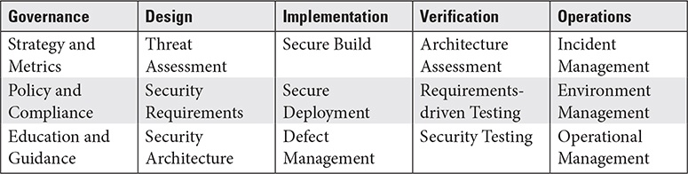
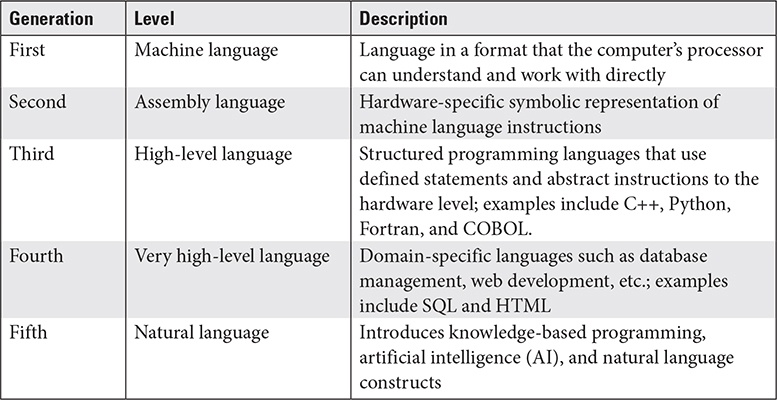

# CISSP Domain 8 - Software Development Security

## Software Development Life Cycle (SDLC)

### Phases

* Requirements gathering (functional - what, performance - how well)
* Design (how)
* Development/acquisition - Programmed internally or acquired
* Testing - Verifying the functional and performance requirements
* Operations/maintenance - Implementing, change management, updates
* Retirement/Replacement

### Development Methodologies

__Waterfall__ 

Structured, sequential, need gatekeeping events (reviews, approvals).

__Incremental__

Each iteration is a finished workable product, also called iterative methodology (multiple instances of Waterfall).

__Spiral__

Each iteration or spiral is carefully planned. Each new spiral has specific objectives it must meet.

__Prototyping__

Customer receives prototypes for testing and approval. A usable version is called an operational prototype.
* Rapid prototypes are pieces of code that fills a functional requirement
* Evolutionary prototypes are built and presented with the intention of incremental improvement through customer feedback

__Rapid Application Development (RAD)__

* The requirements are discovered and built-in as the application is developed and tested
* 60% solution right now is better than a 100% solution in three years

__Agile__

* Promotes agility in software development that is not restricted by the overuse of structured processes
* Focus on delivering small increments of functional code
* Key characteristic of Agile is a user story/a use case from the user's point of view which states the functions, the result and the performance

Key agile methodologies:

* Scrum - Uses a 2w dev interval called a sprint and a daily scrum meeting
* Extreme Programing (XP) - Without the sprints and with more code review (pair programming), where two developers are constantly inputting and checking each other's work. They write test cases before the code is even written
* Kanban - Visual tracking of tasks

__DevOps / DevSecOps__

* Integrated dev teams consists of developers and operations personnel
* Developers and operators can work together to produce code that better meets customer requirements
* DevSecOps integrates security personnel into the DevOps team

### Maturity Models

Formalized model for determining how well organized, defined and managed an organizations development effort is.

__Capability Maturity Model Integration (CMMI)__

Originally developed by Carnegie Mellon University and now managed by ISACA. Provides Measurements and guidance and best practices.

Six maturity levels:

1. Incomplete - No formal processes
2. Initial - Development effort is unpredictable and reactive. Often over budget and behind schedule
3. Managed - Beginnings of a management infrastructure. Basic planning techniques and metrics
4. Defined - Formal organization standards in place that provide structure.
5. Quantitatively Managed - Formal processes and extrapolations of data to gain efficiencies and a roadmap for more effective management
6. Optimizing - Focus on continuous process improvement and long-term software development program strategy

__Software Assurance Maturity Model (SAMM)__

* From OWASP and specially focused on secure software development
* Broken into five critical business functions. Every function is broken down into three security practices which contain security-related activities.
* The total of 15 sec practices can be assessed for effectiveness and maturity

### Operation and Maintenance (O&M)

Version control is of critical importance.

### Change Management

* Must be a formalized process with structure
* Changes must always be carefully considered, tested and documented
* Change control - Process of controlling and documentation of specific changes in an application. Also referred as software version control.

### Integrated product team (IPT)

* Is a management technique where people from a variety of functional areas to be involved in the software development process. IPT often use Agile methods
* Consists of team members with expertise in a wide variety of areas.

## Security Controls in Software Development

Software code can be translated using three different methods:
* Assembler - Assembly language into machine code
* Compiler - High-level language into machine-level formats
* Interpreter - Interprets individual program statements into machine code

__Code module__

Name for a defined piece of code that can be delineated from others.

* Cohesion - How many different types of tasks a module is carrying out. The fewer task the higher the level of cohesion. The higher the cohesion the better.
* Coupling - Interaction of a module with other modules. Low coupling is more desirable than high. 

__Libraries__

* Collection of software components, that can be used across many different projects
* Can be represented as code modules, executables, DLL's
* Developers may need to develop an API to integrate the module

__Tool Sets__

* Customized scripts, homegrown applications, databases, spreadsheets, libraries
* Should be standardized as much as possible
    • Integrated Development Environment (IDE)
* Suite of tools designed for code development with a GUI.
* Enabling developers to frequently check code for errors, execute it in a controlled environment and test it.
* May also be used to control access to code repositories, implement version control and log and audit changes to code as well as security functions

__Runtime__

* Written code for any platform can be executed (sort of mini OS)
* Most often see runtime environments used with mobile code for web-based apps such as Java.
* Serves as a layer between the code and the OS
* Can protect both the running code from non-secure conditions in OS and vice versa

### Continuous Integration and Continuous Delivery (CI/CD)

* Continuous Integration - As soon as the code is developed, tested, and approved, it is automatically integrated into the test/pre-staged environment. Code is developed and merged into the code repository. It the tests yield good results the automated process delivers the code into the repository.
* Continuous Delivery - Constant, incremental rebuild of software versions that can be released at any time. Code can be released into production almost in real time
* Important, that automation pieces are kept secure

### Security Orchestration, Automation and Response (SOAR)

* Integrated platform with all security tools under one umbrella.
* Supports common data formats to easily exchange security information between tools
* Many SIEM suites can also function as SOAR platforms

### Software Configuration Management

* Management process to ensure that software is built and configured to an exacting set of standards
* Documentation and version control are the most important aspects
* Code must be commented, Manuals detailing how to operate an application, security mechanism must be documented
* Any change to the official code base must be documented and version numbers must be incremented. 
* Code base versions must separate between test and production
* Code synchronization ensures that all working versions are synchronized with the latest approved changes

### Code repositories

* Can be a physical and or logical security storage area for code management
* Access control is critical for code repositories
* The ability to audit and identify changes to code must be part of any code repository

### Application Security Testing

* Unit - Test individual pieces of code
* Interface - Tests the interface between the code and other components of the app
* Integration - Tests the integration with other system components. Related to interoperability testing
* Use case - Puts code through the use cases that have been developed from user requirements
* Security - Includes vulnerability testing, penetration testing and misuse case testing

__Static Application Security Testing (SAST)__

* Testing app code without executing it.
* Requires access to the actual source code.
* Code is reviewed line-by-line manually or automated
* Look for syntax errors, known flaws, faulty logic, improper variable use
* More sophisticated can look for input validation, faulty function calls

__Dynamic Application Security Testing (DAST)__

* App is tested while executing.
* Does not require access to the source code.
* Can identify hardware resource overuse, lack of interoperability
* Can create artificial error conditions

__Forms of Application Security Testing__

* Vulnerability testing - Discover known vulnerabilities in code
* Penetration testing - Hack the code with manual and automated methods
* Misuse case testing - Determine all the different ways software can be abused or misused. Checks also if users are using the software incorrectly.
* Fuzzing - A form of misuse case testing. Tests input validation, variable usage and memory management

## Security impact of acquired software

### Commercial-of-the-shelf-Software (COTS)

* Produced by and purchased from companies
* The license for a piece of software determines how it is used, purchased, transferred
* All software should be scanned for vulnerabilities and need patch management

### Open-Source-Software

* Community of developers working to ensure that software is stable and secure
* Can be infiltrated by malicious entities and compromised
* Trace its origins back to verified reputable developers or communities

### Third-Party Software

* Developed specifically for an organization
* Determine to what extent it can trust the developer
* Enforce security mechanisms in development and delivery and SLA's
* I can integrate my code into a framework. If I include libraries, I use the library. The difference between a library and a framework is the question of who has control.

### Managed Services

* Determine if the provider is reputable (due diligence)
* Contract or SLA guaranteeing a specific level of security, responsibilities, functionality and performance
        
### Software-Defined Security
* Enabling advance traffic filtering
* Can perform both content-based filtering and context-based filtering based on rule sets
* Can perform the same functions as hardware firewalls, IDS and procies
* Independent of hardware vendor

