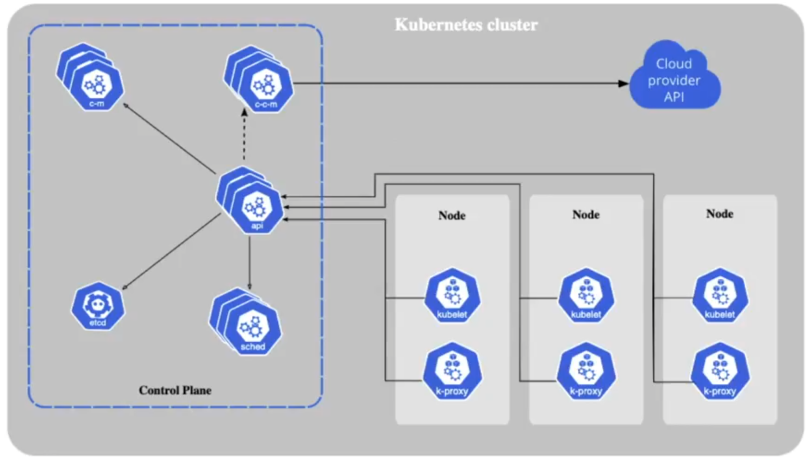
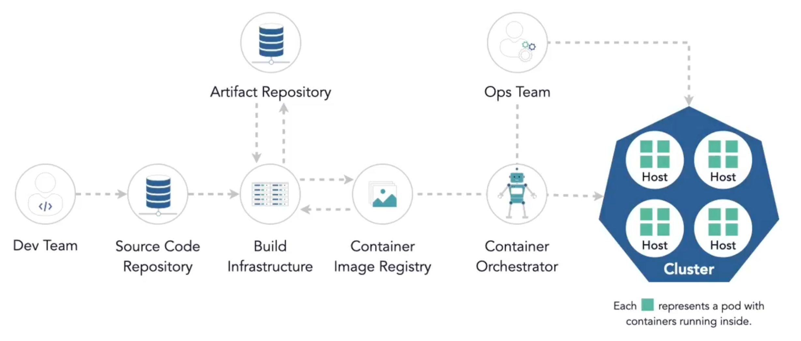
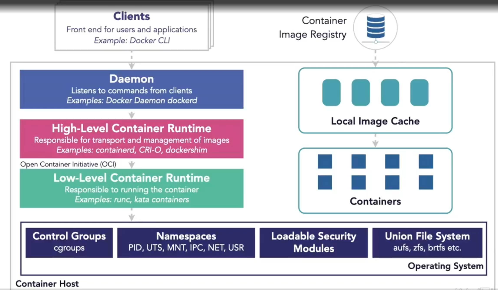
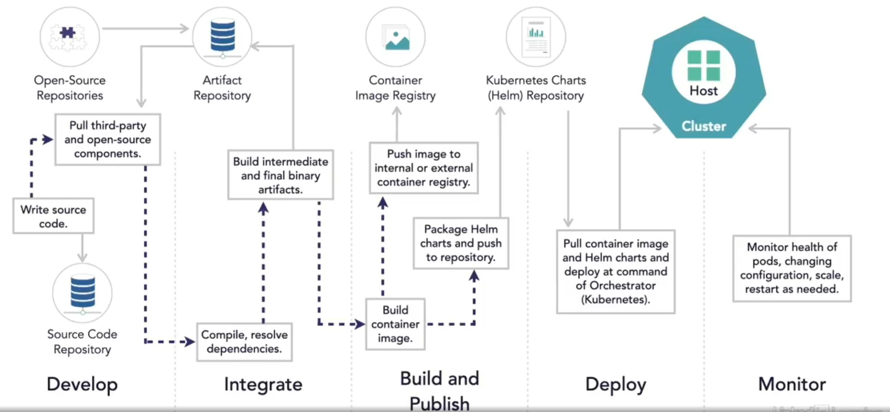
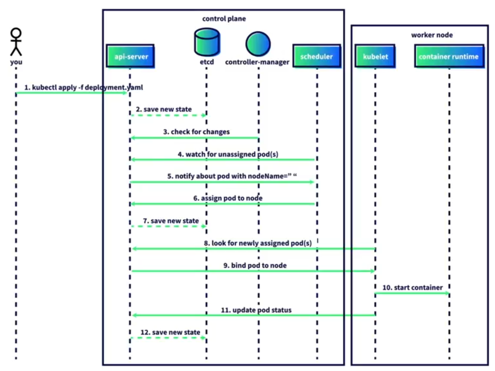
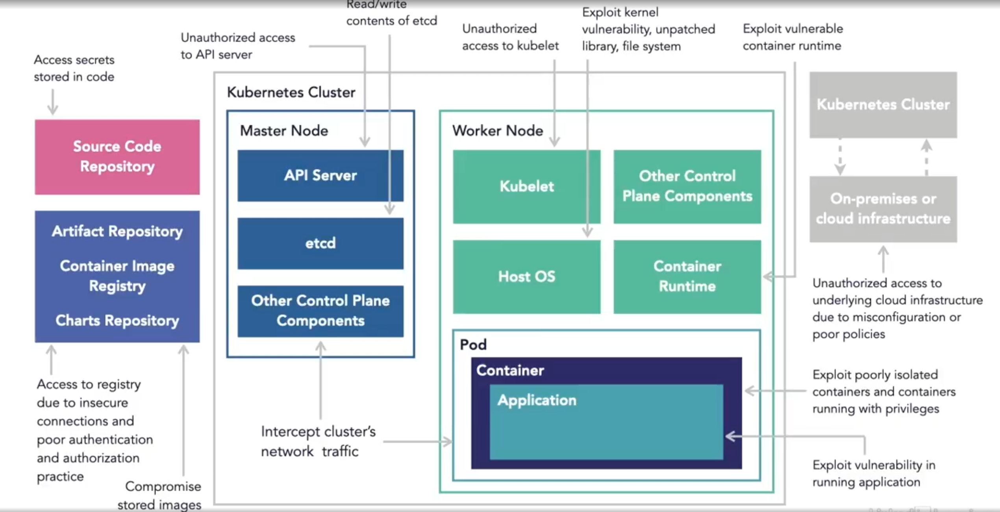

# Kubernetes in a Nutshell

## Kubernetes Overview

Kubernetes is also called K8s. Is written in Go for a planet-scale deployment.

### Kubernetes Architecture

The Kube API Server exposes the Kubernetes API. All Pods, deployments and the horizontal pod autoscaler have API endpoints. Kubernetes API has a REST interface. kubectl and kubeadm are CLI tools to communicate with the Kubernetes API via HTTP requests. 



| Components | Description |
| :---: | :--- |
| API | Handles the requests from inside (pods) and outside (user) the cluster. |
| etcd | Stores key:value pairs. Saves all data about the cluster. Only the API can directly communicate with etcd. It also runs as a pod. |
| sched | Schedules new created pods to run on worker nodes. |
| Controller Manager (c-m) | Loop that checks if the cluster is running properly. It for example checks the health of the worker nodes and replace them if necessary. |
| Cloud Controller Manager (c-c-m) | Connect the cluster with a cloud provider API. |

__Important Note__: Cloud Managed Kubernetes Services like AWS EKS or Googles GKE will hide the Cluster-Pods from kubectl.

### Worker

Workers are like Terminals of an airport. The most clusters consist of at least three worker nodes. There are different Components of a worker:

| Components | Description |
| :---: | :--- |
| Kubelet | An agent that runs on every worker node. Ensure, that containers in a pod are running and healthy. Communicates directly with the API-Server in the control plane. |
| Container Runtime | New pods start a container using the Container Runtime Interface (CRI). Enable the Kubelet to create containers with the engines Containerd, CRI-O, Kata Containers, AWS Firecracker. Dockershim-Engine was removed in Kubenetes v1.24 but Docker-Images can still run in Kubernetes. |
| Kube-proxy | Makes sure pods and services can communicate. Each Kube-proxy communicates directly with the Kube-apiserver. |

### Kubernetes Architecture



### Container Runtime Architecture



### Development, Deployment and Orchestration Lifecycle



### Pod Deployment Process

The following pictures show the things happening when a pod is deployed:



### Data Storage / Running stateful workloads

You can choose one of two options:

1. A database independent of the cluster
2. A Kubernetes Persistent Volume

### Container Technologies

* Docker
* podman
* Containerd
* rkt
* LXD

### YAML

* Acronym for YAML ain't Markup Language
* Files can have the endings .yml and .yaml
* One file can contain multiple documents seperated by a startin '---'.
* Comments are placed with a '#'
* Consists of 'key: value' pairs
* Indentations are used as lists like indentated key:value-Pairs or Arrays of strings with '-' in front.
* YAML-Files can be validated by [YAML Checker](https://yamlchecker.com)

## CLI Tools

### Minikube Commands

Minikube is a small Kubernetes Cluster packed in a Docker Container.

| Command | Description |
| :--- | :--- |
| minikube addons enable <name> | Enable an add-on |
| minikube addons list | List available add-ons |
| minikube dashboard | Shows the minikube Dashboard |
| minikube delete | Delete the minikube cluster |
| minikube pause | Pause the deployments |
| minikube service -n <namespace> --url <service-name> | Get the service URL |
| minikube start | Start the minicube cluster |
| minikube tunnel | Create a tunnel for entering the pods via a public service |
| minikube unpause | Unpause the deployments |

### Kubeadm

A tool for creating and configuring Kubernetes clusters quickly.

Process of setting up a cluster:

1. Download and install a container runtime, kubeadm, kubelet and kubectl
2. Configure a cgroup driver
3. Inizialize kubeadm on the master node to set up the control plane
4. Copy and save the node join command with the token
5. Install a network plugin of your choice for Pod networking
6. Join the worker nodes to the master node using the kubeadm join command
7. Deploy and validate a sample app

### kOps

A tool for creating and configuring a production Kubernetes environment.

| Command | Description |
| :--- | :--- |
| kops create cluster | Create a cluster |
| kops update cluster | Updates the resources |
| kops get clusters | Show running clusters |
| kops delete cluster | Delete a cluster |
| kops toolbox template | Creating configuration templates |


[Download kOps](https://kops.sigs.k8s.io/getting_started/install)

### Kubectl

The most widespread CLI Tool to interact with the Kubernetes API Server.

| Command | Description |
| :--- | :--- |
| kubectl api-resources | Get all API-Resources |
| kubectl cluster-info | Get status of the cluster |
| kubectl config get-contexts | Get Cluster-Connection Informations. |
| kubectl config use-context <context-name> | Use a specific cluster-connection. |
| kubectl create deployment <name> --image <imagename> | Imperative deployment of an image. |
| kubectl apply -f <file> | Create stuff out of YAML-Files. I.e. namespaces out of namespace.yaml or deployments via deployment.yaml. |
| kubectl delete -f <file> | Delete stuff out of YAML-Files. I.e. namespaces out of namespace.yaml |
| kubectl delete pod <podname> -n <namespace> | Delete a specific pod from a namespace. |
| kubectl describe pod <podname> -n <namespace> | Watch Pod infos with errors included. |
| kubectl exec -it <podname> -- <shell> | Execute a function in the interactive terminal like /bin/sh on a busybox pod. |
| kubectl get deployments -n <namespace> | Control the existence of deployment. |
| kubectl get namespaces | Isolate and manages applications. Shortened by get ns. |
| kubectl get nodes | Get Node infos |
| kubectl get pods -A | Shows the Pods in every namespace (-A) |
| kubectl get pods -n <namespace> | Show the Pods in a specific namespace. |
| kubectl get pods -n <namespace> -o wide | Show the Pods in a specific namespace with additional info like IP-Adresses. |
| kubectl get pods -n kube-system | Kubernetes system pods |
| kubectl get services (-n <namespace>) | Shows the Services running in the cluster |
| kubectl logs <podname> -n <namespace> | View the logs of a pod. For example the etcd pod with kubectl logs etcd-minicube -n kube-system jq . |

### Kubie

A tool for easy switching between clusters and namespaces.

| Command | Description |
| :--- | :--- |
| kubie ctx | Choose and switch Cluster-Context |

[Download Kubie](https://www.github.com/sbstp/kubie)

### K9s

A terminal UI to ease the use of kubectl-Commands. It relates to VIM-Commands.

| Command | Description |
| :--- | :--- |
| k9s | Start the CLI |
| k9s version | Show the Programversion |

[Download K9s](https://www.k9scli.io/topics/install)

## Development Tools

### Telepresence

Open-Source tool that lets you see the impact of code changes without waiting for the build/push/test-cycle.

[Website](https://app.getambassador.io)

### Tilt

Enable local continuous development and deployment of microservice applications via CLI and web user interface.

[Website](https://docs.tilt.dev)

### Lens IDE

Provides a graphical interface that allows users to deploy and manage Kubernetes clusters directly from the console. Has built-in dashboards with key metrics and insights into resources running on a cluster.

## Deployment Tools

### Helm

Is often called the Kubernetes app store. It's the package manager for Kubernetes like apt or Homebrew. It enables you to streamline the process of deploying and managing applications on Kubernetes clusters. 

* Charts - Building reusable Applications as versioned artifacts.
* Repositories - Collecting and releasing charts
* Releases - Instances of Charts running in a Kubernetes cluster.

| Command | Description |
| :--- | :--- |
| helm create <name> | Create a helm chart |
| helm install <name> <package-name> | Install a package |
| helm repo add <name> <URL>| Add a package to the repository |
| helm search repo (<name>)| Show available packages |
| helm version | Show version |

[Download Helm](https://www.helm.sh/docs/intro/install)

### Kubespray

An open-source tool for deploying and managing Kubernetes clusters. It is used when Clusters should be running on-premises, bare-metal or native in the cloud without using managed services to keep control over the Cluster Control Plane.

## Monitoring Tools

### Kubernetes Dashboard

A Web-Based user interface for Kubernetes clusters. Enables you to manage clusters and the applications running in them. It isn't available by default. It is available as a container and has to be manually deployed into the Kubernetes cluster. 

### Prometheus

Out-of-the-box monitoring capabilities for Kubernetes. Is free and has an active community. 

### Jaeger

Open-source tool that is used for monitoring and troubleshooting transactions in Kubernetes. Has an all-in-one-image. 

## Other tools

See the Tool-Landscape at [CNCF Landscape](https://landscape.cncf.io/)

## Procedures

### Procedure to install an application

1. Create a name space - kubectl apply -f namespace.yaml
2. Have an image available
3. Have a descriptive deployment.yaml file to copy the image to the namespace
4. Deploy the image - kubectl apply -f deployment.yaml
5. Check the deployment - kubectl get deployment -n development
6. Spin up a busybox pod - kubectl apply -f busybox.yaml
7. Get origin pod's IP - kubectl get pods -n <namespace> -o wide
8. Connect to the pod - kubectl exec -it <podname> -- /bin/sh
9. Connect via the busybox shell and wget. Look at the deployment.yaml for the pods Port

### Connecting an application to the internet

1. Start the pods if not already done.
2. Create a service YAML with the following lines:

```
---
apiVersion: v1
kind: Service
metadata:
    name: demo-service
    namespace: development
spec:
    selector:
        app: pod-info
    ports:
        - port: 80
            targetPort: 3000
    type: LoadBalancer
```
3. Enter the pods with the appopriate URL. Get it by minikube service -n <namespace> --url <service-name>

### Shutdown the cluster

1. Delete the files by kubectl delete -f <file.yaml>. Delete the namespaces last.
2. Delete Minikube by minikube delete

## Kubernetes Security

### OS Security Features

#### OS Namespace Feature

As a Linux Kernel Feature Namespaces organize resources to be shared among processes. Processes in a namespace cannot "see" resources (for example the Process-ID's) in other namespaces.

#### Control Groups

Setting usage limits on resources, for example CPU and memory.

#### System Call Capabilities

Linux capabilities, break up root privileges into smaller slices. They are sets of privileges that can be independently enabled or disabled.

#### Loadable Security Modules (LSM)

Kernel Feature for Access Control to system resources. Those Mandatory access control (MAC) systems are SELinux and AppArmor. Like Loadable Security Modules they are not part of the Kernel Code. 

#### Seccomp

Tansitions a process to a secure state, limiting its capabilities. 

### Attack Vectors



### Securing Containerized Application Code

Embedding security in all stages of Software development life cycle (SDLC). 

Publications are:
* [SAFECode.org](https://safecode.org/)
* [NIST SP 800-218](https://nvlpubs.nist.gov/nistpubs/SpecialPublications/NIST.SP.800-218.pdf)

Utilize Static Analysis Security Testing (SAST) directly in the IDE, in the Code Repository or the Automated Build Pipeline. And use Software Composition Analysis to identify security issues in open-source and commercial software components. This can be done in the Artifact Respository or the Build Pipeline.

Utilize Dynamic Application Security Testing (DAST) before going into production.

### Securing Images

* Start with a minimal base image you trust (golden image) like alpine, busybox or from scratch.
* Bundle as least components as possible in your image.
* Least privileges in the Image. Without user instruction, container runs as a root.
* Don't include binaries with setuid-Bit on.
* Don't include unwanted objects in an Image like vulnerable binaries or secrets.
* Use Image Signing to provide a digital signature to verify the integrity of the Image.
    * The Update Framework (TUF) is a framework to secure software upgrade process
    * Notary is an implementation of TUF
* Least Privileges in the Image Registry.
* Segregation of Duties in the CI/CD-Pipepline (i.e. a developer can upload code but cannot deploy.)
* Pull images by digests instead of tags or use immutable tags.

### Securing Hosts and Container Working Environment

* Override image instruction by starting a container with 'docker run --user' command
* Don't use the 'docker run --privileged <image>' command to limit the containers system-call abilities.
* Apply network policies to secure inter-pod communication in Kubernetes.
* Create a network where only containers are attached, that need to communicate.
* Minimize Host OS attack surface like ThinOS, VMware Photon or Red Hat CoreOS and harden existing OS.
* Don't use containerized and non-containerized workloads on the same host.
* Protect host file system from malicious containers
* Mount host file system as read only to container

### Deployment Security

1. Add SecurityContext to the deployment file of the pods.
```
securityContext:
    allowPrivilegeEscalation: false
    runAsNonRoot: true
    capabilities:
        drop:
            - ALL
        readOnlyRootFilesystem: true
```
2. Scan the deployment files (or kubernetes-manifests) with scanners like Snyk.
3. Get Informed about Patches trough [OpenCVE](https://www.opencve.io/) or other Vulnerability Databases.
4. Use the Kubernetes Hardening Guides like [NSA/CISA Kubernetes Hardening Guide](https://www.nsa.gov/Press-Room/News-Highlights/Article/Article/2716980/nsa-cisa-release-kubernetes-hardening-guidance/) or CIS-Benchmarks.

Scan Images with tools like:

* Claire
* kube-bench
* Twistlock (Palo Alto Networks)
* Aqua Security
* WhiteSource

## Securing applications

### Pod Security Standards

There are three different Profiles:

| Profile | Description |
| :---: | :--- |
| Privileged | Unrestricted permissions. |
| Baseline | Generic and useful for noncritical workloads. |
| Restricted | Most restrictive and most secure. Read-Only pods and limited to only necessary options. |

In addition to that, there are 3 Modes to apply these Standards: Enforce (reject pods with policy violations), Audit (allows pods but include an event in the audit log) and Warn (allows pods but directly notify the users).

### Access Management

#### Authentication

Kubernetes has user (human) and service (machine) accounts.

It supports at least the following authentication methods:

* Static password
* Token file
* X.509 certificate
* OpenID Connect (OAuth 2.0 spec) tokens
* Service account tokens
* Other 

#### Authorization

By default, all permissions are denied. Verbs are create, update, delete and get.

#### Admission Controller

Intercepts request and validates it depending on the plugin.

#### Security Context

Mechanism for developers to define what a container should do or not.

```
---
apiVersion: v1
kind: Pod
spec:
    containers:
        securityContext:
            runAsNonRoot: true
            privileged: true
```

#### Security Policy

Mechanism for admin to define what a container really can do or not. Is implemented via admission controllers.

```
---
apiVersion: v1
kind: Pod
spec:
    securityContext:
        runAsUser: 999
```
### Kubernetes Networking

By default every pods can talk to each other without restrictions. Kubernetes allow network policies that let you control inter-pod traffic.

```
---
apiVersion: v1
kind: NetworkPolicy
spec:
    podSelector:
        matchLabels:
            svcType: catalog
    ingress:
    - from:
        - podSelector:
            matchLabels:
                svcType: order
    egress:
    - to:
        - podSelector:
            matchLabes:
                svcType: warehouse
```
### Secrets

A secret object are key-value pair which are stored in etcd as base64 encoded value and are encrypted from Kubernetes 1.7 onward.

Secrets can be passed to the application via a Mounted Volume or environment variables.

A pod mounts a secrets volume by default (/var/run/secrets/kubernetes.io/serviceaccount) to talk to the API Server.

Secrets can be entered via 'kubectl create secret', Third-Party-Solutions or kubectly apply -f <secretsFile>.yaml.

## Security the Cluster

### Securing API Service

Ensure in API server pod specification file

```
#/etc/kubernetes/mainfests/kube-apiserver.yaml

--insecure-pod is set to 0
--insecure-bind-address does not exist
--client-ca-file is set to <path to client-ca-file>
--tls-cert-file is set to <path to tls-certificate-file>
--tls-private-key-file is set to <path to tls-key-file>
```

Accept and serve only HTTPS traffic by setting up a TLS connection on the API server. 

### Protecting etcd

Ensure you restrict access to etcd. 

```
#/etc/kubernetes/mainfests/etcd.yaml

--cert-file=</path/to/ca-file>
--key-file=</path/to/key-file>
--client-cert-auth=true
```

### Protecting kubelet

Disable anonymous requests and over https.

### Limit Resource Usage

Use ResourceQuota and LimitRange.

## Terms

| Term | Description |
| :---: | :--- |
| Cloud-native | Open-Source projects designed to let technologists use cloud computing services to automatically deploy and scale applications. |
| Cluster | A Kubernetes Instance. Each cluster has a control plane and at least one worker node. |
| Container | A technology that bundles the code for an application, and the configuration required to run the code itself in one unit. It the running process that is instantiated from a container image. |
| Container Image | A file with executable code that can be run as a container. |
| Container Registry | A database that stores container images. Examples: Docker Hub, Quay, Google Container Registry. |
| Namespace | A virtual Cluster inside a physical Kubernetes Cluster. |

## OPEN QUESTIONS

* How do I create a testing environment with maximum privileges?
* How do I perform lateral movement/privilege escalation/bypass isolation boundary on a cluster?
* Have a look at: https://kubernetes.io/blog/2021/10/05/nsa-cisa-kubernetes-hardening-guidance/
* How do I know, which capabilities are configured for a container?
* How do I scan the real/effective Containers capabilities in a Kubernetes worker node?

